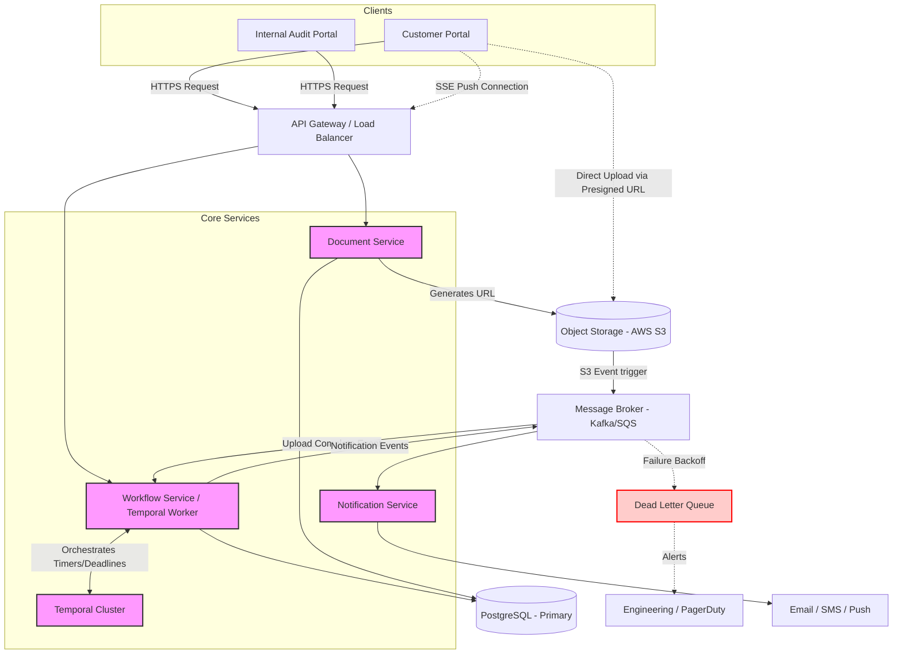
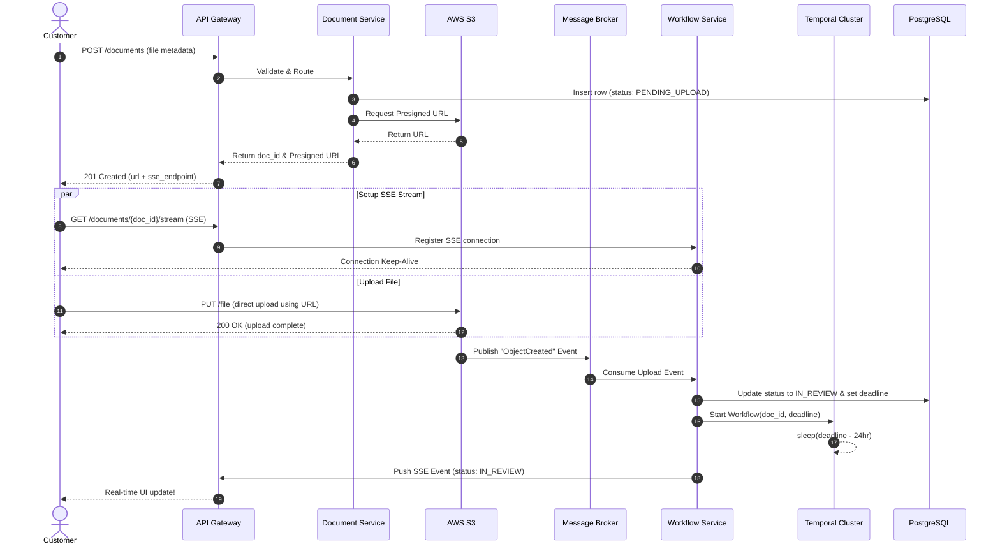
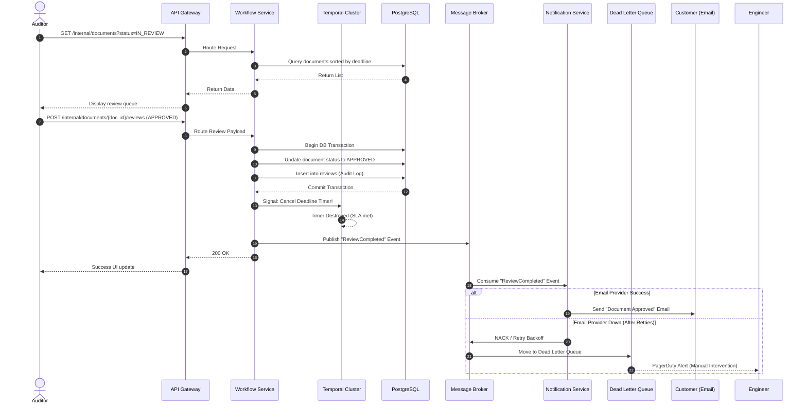

# System Design: Document Upload and Review System (HLD)

## 1. Overview & High-Level Architecture

### Core Requirements
**Functional:**
1. Users upload documents of any size.
2. Internal audit team manually reviews the documents.
3. Internal audit team receives notifications when a document review deadline approaches.
4. Customers are notified of the review outcome (Approved/Rejected).
5. Customers can re-upload or cancel reviews based on outcomes.

**Non-Functional:**
1. **High Scalability & Availability:** Must handle massive file uploads without degrading application server performance.
2. **Fault Tolerance:** System must not lose documents or drop notifications.

**Out Of Scope**
1. Reading/Rendering files that don't support web view
2. Fine-grained authorization for Auditors in internal review
3. Reviewer and user lifecycle management

### MVP Architecture Diagram

```mermaid
graph TD
    subgraph Clients
        Cust[Customer Portal]
        Aud[Internal Audit Portal]
    end

    APIG[API Gateway / Load Balancer]

    Cust -->|HTTPS Request| APIG
    Aud -->|HTTPS Request| APIG

    subgraph Core Services
        DS[Document Service]
        WS[Workflow & State Service]
        NS[Notification Service]
        Sched[Deadline Scheduler]
    end

    APIG --> DS
    APIG --> WS

    %% Upload Flow
    Cust -.->|Direct Upload via Presigned URL| S3[(Object Storage - AWS S3)]
    DS -->|Generates URL| S3
    S3 -->|S3 Event trigger| MQ[Message Broker - Kafka/SQS]
    MQ -->|Upload Complete Event| WS

    %% Data layer
    DS --> PrimaryDB[(PostgreSQL - Primary)]
    WS --> PrimaryDB
    PrimaryDB -.-> ReadReplica[(PostgreSQL - Replica)]
    Sched -->|Polls for Deadlines| ReadReplica

    %% Async & Comms
    WS -->|Review/Deadline Events| MQ
    MQ --> NS
    Sched -->|Triggers Deadline Logic| WS
    NS --> Ext[Email / SMS / Push]

    classDef service fill:#f9f,stroke:#333,stroke-width:2px;
    class DS,WS,NS,Sched service;
```


## 2. Component Deep Dive & Core Workflows

---

### Core Components

* **API Gateway**: Handles authentication, rate limiting, and routes requests to appropriate backend services.
* **Document Service**: Responsible for file metadata and orchestrating the upload process. Crucially, it **does not process the file bytes directly**, which protects the system from memory exhaustion and network bottlenecks.
* **Object Storage (AWS S3 / GCS)**: Stores the actual document blobs. Highly scalable, durable, and natively supports large files and multipart uploads.
* **Workflow & State Service**: The "state machine" of the system. It tracks the lifecycle of a document (e.g., `PENDING_UPLOAD`, `IN_REVIEW`, `APPROVED`, `REJECTED`, `CANCELED`).
* **Deadline Scheduler**: Constantly checks for documents approaching their SLA/deadline and triggers alerts via the notification system.
* **Message Broker (Kafka / SQS)**: Decouples services. Used for asynchronous event processing (e.g., notifying the system when an S3 upload finishes, or queuing emails).
* **Notification Service**: Listens to events from the message broker and formats them into emails, in-app notifications, or Slack messages for both customers and internal auditors.

---

### Core Workflows

#### A. Handling "Any Size" Document Uploads
Passing huge files (e.g., 5GB PDFs or zips) through backend application servers causes network saturation and out-of-memory (OOM) errors. We solve this using the **Presigned URL pattern**:

1.  **Client** calls `POST /documents` with metadata (filename, size).
2.  **Document Service** creates a DB record with status `PENDING_UPLOAD`.
3.  **Document Service** requests a Presigned URL from S3 and returns it to the client.
4.  **Client** uploads the file bytes directly to S3 using the URL.
5.  **S3** fires an event to the Message Broker upon successful upload.
6.  **Workflow Service** consumes the event, updates the DB status to `IN_REVIEW`, and sets the `deadline_at` timestamp.

#### B. Deadline Tracking System
To efficiently track deadlines among millions of documents:

1.  We index the `documents` table on `(status, deadline_at)`.
2.  The **Deadline Scheduler** queries the Read Replica:
    ```sql
    SELECT id 
    FROM documents 
    WHERE status = 'IN_REVIEW' 
      AND deadline_at <= NOW() + INTERVAL '24 HOURS' 
      AND deadline_notified = FALSE;
    ```
3.  It drops these document IDs into a **Kafka topic**.
4.  The **Notification Service** picks them up and alerts the audit team.

## 3. Detailed API Specifications

The APIs follow **RESTful principles**, utilizing JSON payloads and standard HTTP status codes.

---

### 3.1. Customer API: Initialize Document Upload
Initializes the upload process and generates a Presigned URL.

* **Endpoint:** `POST /api/v1/documents`
* **Headers:** `Authorization: Bearer <Customer_Token>`

**Request Body:**
```json
{
  "file_name": "employee_passport_2026.pdf",
  "file_size_bytes": 10485760,
  "document_type": "IDENTIFICATION",
  "mime_type": "application/pdf"
}
```
**Response (201 Created):**
```json
{
  "data": {
    "document_id": "d-8f7b2a9c-11e2",
    "status": "PENDING_UPLOAD",
    "upload_url": "[https://rippling-docs.s3.amazonaws.com/...&X-Amz-Signature=](https://rippling-docs.s3.amazonaws.com/...&X-Amz-Signature=)...",
    "upload_expires_in_seconds": 3600
  }
}
```
### 3.2. Customer API: Get Document Status
* **Endpoint:** `GET /api/v1/documents/{document_id}`
* **Headers:** `Authorization: Bearer <Customer_Token>`

**Response (200 OK):**

```json
{
  "data": {
    "document_id": "d-8f7b2a9c-11e2",
    "status": "APPROVED",
    "deadline_at": "2026-05-01T12:00:00Z",
    "review_comments": "All looks good.",
    "updated_at": "2026-04-27T10:15:00Z"
  }
}
```
### 3.3. Customer API: Re-upload / Rectify Document
Used when a document is rejected and the customer needs to upload a corrected version.

* **Endpoint:** `POST /api/v1/documents/{document_id}/reupload`

* **Headers:** `Authorization: Bearer <Customer_Token>`

**Request Body:**

```json
{
  "file_name": "employee_passport_2026_corrected.pdf",
  "file_size_bytes": 12000000,
  "mime_type": "application/pdf"
}
```
**Response (200 OK):**

```json
{
  "data": {
    "document_id": "d-8f7b2a9c-11e2",
    "status": "PENDING_UPLOAD",
    "upload_url": "[https://rippling-docs.s3.amazonaws.com/...(new_url)](https://rippling-docs.s3.amazonaws.com/...(new_url))",
    "message": "Previous file invalidated. Please upload the new file."
  }
}
```
### 3.4. Internal Audit API: Fetch Queue
Fetches a list of documents pending review, sorted by approaching deadlines.

* **Endpoint:** `GET /api/internal/documents`
* **Query Parameters:** `?status=IN_REVIEW&sort_by=deadline_at:asc&limit=50`
* **Headers:** `Authorization: Bearer <Auditor_Token>`

**Response (200 OK):**

```json
{
  "data": [
    {
      "document_id": "d-12345678",
      "document_type": "W4_FORM",
      "status": "IN_REVIEW",
      "deadline_at": "2026-04-28T10:00:00Z",
      "time_remaining_hours": 24
    }
  ]
}
```
### 3.5. Internal Audit API: Submit Review
Submits the final decision on a document. This API is idempotent.

* **Endpoint:** `POST /api/internal/documents/{document_id}/reviews`

* **Headers:** `Authorization: Bearer <Auditor_Token>`

**Request Body:**

```json
{
  "outcome": "REJECTED",
  "comments": "The signature on page 2 is missing. Please sign and re-upload.",
  "auditor_id": "a-554433"
}
```

**Response (201 Created):**

```json
{
  "data": {
    "document_id": "d-12345678",
    "status": "REJECTED",
    "review_id": "r-999888",
    "message": "Review submitted successfully. Customer will be notified."
  }
}
```
## 4. Persistence & Data Model

We use **PostgreSQL** as our primary relational database to ensure strict ACID transactions and maintain relational integrity between Users, Documents, and Review events.

---

### 4.1. Table: `users`
Stores information for both Customers and Auditors.

| Column | Type | Constraints |
| :--- | :--- | :--- |
| `id` | UUID | Primary Key |
| `email` | VARCHAR | Unique, Not Null |
| `role` | VARCHAR | ENUM ('CUSTOMER', 'AUDITOR') |

---

### 4.2. Table: `documents`
The central table for tracking document metadata and lifecycle state.

| Column | Type | Constraints | Notes |
| :--- | :--- | :--- | :--- |
| `id` | UUID | Primary Key | |
| `customer_id` | UUID | Foreign Key | Indexed for fast lookups by user. |
| `document_type` | VARCHAR | Not Null | e.g., 'PASSPORT', 'W4' |
| `s3_bucket_key` | VARCHAR | Not Null | Path to the actual file blob in S3. |
| `status` | VARCHAR | ENUM | PENDING_UPLOAD, IN_REVIEW, APPROVED, REJECTED, CANCELED |
| `created_at` | TIMESTAMP | DEFAULT NOW() | |
| `updated_at` | TIMESTAMP | DEFAULT NOW() | |
| `deadline_at` | TIMESTAMP | | Indexed with `status` for deadline tracking. |
| `deadline_notified`| BOOLEAN | DEFAULT FALSE | Prevents duplicate alerts for the same deadline. |

---

### 4.3. Table: `reviews` (Audit Trail)
Acts as an **append-only** audit log for compliance and historical tracking.

| Column | Type | Constraints |
| :--- | :--- | :--- |
| `id` | UUID | Primary Key |
| `document_id` | UUID | Foreign Key |
| `auditor_id` | UUID | Foreign Key |
| `outcome` | VARCHAR | ENUM ('APPROVED', 'REJECTED') |
| `comments` | TEXT | |
| `created_at` | TIMESTAMP | DEFAULT NOW() |

## 5. Architecture Decisions & Trade-offs

This section outlines the critical design choices made for the Document Lifecycle system, comparing alternative approaches and detailing the final decisions based on scalability and compliance requirements.

---

### Trade-off 1: Cron Scheduler vs. Distributed Workflow Orchestrator (Temporal)

**Where it fits:** Deadline Scheduler and Workflow & State Service.

#### The Problem
Documents have a strict "time to review" (SLA). We need a reliable mechanism to trigger an alert exactly 24 hours before the deadline expires.

#### Approach A: Cron Job + DB Polling (Simpler)
* **Design**: A scheduled worker runs every 5 minutes and queries the Read Replica.
    ```sql
    SELECT id FROM documents 
    WHERE deadline < NOW() + INTERVAL '24 HOURS' 
    AND status = 'IN_REVIEW' 
    AND deadline_notified = FALSE;
    ```
* **Pros**: Easy to build; utilizes standard infrastructure (Postgres, Cron).
* **Cons**: Scaling issues with millions of rows; potential for missed windows if the job crashes; creates "thundering herd" spikes on the database every 5 minutes.

#### Approach B: Distributed Orchestrator (Temporal/Cadence)
* **Design**: When a document enters `IN_REVIEW`, a stateful workflow starts. The logic uses a durable timer: `sleep(deadline - 24 hours); sendNotification();`.
* **Pros**: Extremely scalable; handles millions of concurrent timers; implicit retries and state persistence.
* **Cons**: High operational overhead to maintain a Temporal cluster.

**Conclusion**: For a startup, **Approach A** is sufficient. For a massive enterprise like Rippling with strict compliance SLAs, **Approach B** is the standard and replaces the standalone Deadline Scheduler entirely.

---

### Trade-off 2: Client-side Polling vs. Server-Sent Events (SSE)

**Where it fits**: Connection between the Customer Portal (Client) and API Gateway.

#### The Problem
Since the client uploads massive files directly to S3, the browser needs a way to know when the backend has successfully processed the S3 event and updated the document status to `IN_REVIEW`.

#### Approach A: Client Polling
* **Design**: The frontend calls `GET /api/v1/documents/{id}` every 3 seconds until the status changes.
* **Pros**: Simplest to implement; stateless backend.
* **Cons**: Wasteful network traffic; can overload the API Gateway and Database with redundant read requests.

#### Approach B: Server-Sent Events (SSE)
* **Design**: The client establishes a one-way SSE connection. When the Workflow Service processes the Kafka event from S3, it pushes the update directly to the client.
* **Pros**: Immediate updates; superior UX; significantly lower API and DB load.
* **Cons**: Requires persistent connections; slightly more complex load balancing.

**Conclusion**: **Use SSE**. It is perfectly suited for one-way server-to-client notifications (unlike the overhead of bi-directional WebSockets) and drastically reduces system-wide load.

---

### Trade-off 3: Ensuring Fault Tolerance with Dead Letter Queues (DLQs)

**Where it fits**: Between the Message Broker (Kafka/SQS) and the Notification Service.

#### The Problem
If a 3rd-party provider (e.g., SendGrid) is down, we cannot afford to lose critical approval or rejection notifications.

#### Implementation Strategy: At-Least-Once Delivery
1.  The **Notification Service** consumes a message from the broker.
2.  If the email fails to send, the message is **not** acknowledged.
3.  The broker retries with **exponential backoff** (e.g., 1m, 5m, 15m).
4.  After 5 failed attempts, the message is moved to a **Dead Letter Queue (DLQ)**.
5.  **Engineering Alerts**: DLQ activity triggers a PagerDuty alert for manual intervention to ensure no notification is lost.

---

### Trade-off 4: Data Deletion Strategy (Soft vs. Hard Deletes)

**Where it fits**: Primary Database and Object Storage (S3).

#### The Problem
Handling "Cancel Review" requests or document rejections in a way that balances user privacy with regulatory compliance.

#### Implementation Strategy
In the HR and Compliance domain, immediate hard deletion is risky due to accidental clicks and the necessity of audit trails.

* **Database (PostgreSQL)**: We use **Soft Deletes**. Rows are updated to `status = 'CANCELED'` with a timestamp. This preserves the audit trail for compliance teams.
* **Object Storage (S3)**: We utilize **S3 Lifecycle Policies**.
    * **30 Days**: Move canceled/rejected files to a cheaper tier (**S3 Glacier**).
    * **90 Days**: Permanently **Hard-Delete** the files to remain compliant with GDPR/CCPA "Right to Erasure" regulations.

## 6. The Evolution: MVP to Enterprise Scale

In a standard startup environment, we would deploy a Minimum Viable Product (MVP) architecture. However, at Rippling's enterprise scale (millions of documents, strict compliance SLAs, massive traffic spikes), the MVP architecture introduces critical bottlenecks. Here is a deep dive into the MVP components and exactly *how* and *why* we are upgrading them.

### A. Deadline Tracking
*   **MVP Component (Cron Scheduler):** A standard cron job runs every 5 minutes, querying a Postgres Read Replica to find documents where `deadline < NOW() + 24hr`.
*   **The Bottleneck:** As the table grows to millions of rows, polling creates "thundering herd" spikes of database load and expensive table scans. If the cron worker crashes, SLAs are missed.
*   **Enterprise Upgrade (Temporal / Cadence):** We replace the Cron Scheduler entirely with a distributed workflow orchestrator like **Temporal**. When a document enters `IN_REVIEW`, Temporal starts a stateful workflow holding a timer in memory (`sleep(deadline - 24 hours)`). This removes all DB polling and guarantees execution at exact milliseconds across a distributed cluster.

### B. Client Real-Time Updates
*   **MVP Component (Client Polling):** After a customer uploads a large file directly to S3, their browser calls `GET /documents/{id}` every 3 seconds to check if the backend has registered the file.
*   **The Bottleneck:** This generates massive, wasteful network traffic and overloads the API Gateway and Database with useless reads.
*   **Enterprise Upgrade (Server-Sent Events - SSE):** We upgrade to a push-model. The client establishes a one-way persistent **SSE connection** during upload. When the backend processes the S3 upload event, it pushes the state change down the open pipeline, providing instant UX with minimal server overhead.

### C. Fault Tolerance & Delivery Guarantees
*   **MVP Component (Basic Message Broker):** A standard queue passes events to the Notification Service to send emails via SendGrid/SES.
*   **The Bottleneck:** If the 3rd-party email provider has an outage, the message fails, is discarded, and the customer is never notified of their approval/rejection.
*   **Enterprise Upgrade (Dead Letter Queues - DLQ):** We implement At-Least-Once delivery. If an email fails, the broker retries with exponential backoff. If it fails repeatedly, it moves to a **DLQ**. This triggers an automated PagerDuty alert to Engineering to manually intervene. No notification is ever lost.

### D. Data Deletion & Compliance
*   **MVP Component (Hard Deletes):** When a user cancels a review, the application issues a `DELETE` SQL statement and immediately deletes the S3 object.
*   **The Bottleneck:** In the HR domain, accidental hard-deletions destroy critical audit trails and violate compliance norms.
*   **Enterprise Upgrade (Soft Deletes + S3 Lifecycle Policies):** The DB uses soft deletes (`status = 'CANCELED'`). We rely entirely on AWS S3 Lifecycle Policies to automatically transition canceled/rejected files to Glacier (cold storage) after 30 days, and hard-delete them after 90 days for GDPR/CCPA compliance.

---

## 7. Enterprise Architecture Diagram

*This diagram reflects the upgraded enterprise state, featuring Temporal orchestration, SSE push connections, and Dead Letter Queues.*

# Enterprise Component Deep Dive & Sequence Flows

This document details the responsibilities of each component in the Enterprise High-Level Design (HLD) and maps out the exact sequence of interactions for the two most critical workflows: Customer File Upload and Internal Document Review.

---

## 1. Enterprise Component Deep Dive

### **1.1. Edge & Entry Layer**
*   **Customer & Auditor Portals (Frontend):** Single Page Applications (React/Vue) that communicate via REST APIs. The Customer Portal implements Server-Sent Events (SSE) to listen for real-time status updates without polling.
*   **API Gateway / Load Balancer:** The unified entry point for all external traffic.
    *   *Responsibilities:* SSL termination, JWT authentication & authorization (routing Auditors to internal endpoints and Customers to external ones), rate limiting (preventing DDoS), and holding long-lived SSE connections open for the frontend.

### **1.2. Core Microservices**
*   **Document Service:** The metadata manager.
    *   *Responsibilities:* Validates file extensions/sizes, creates the initial DB records (`PENDING_UPLOAD`), and generates AWS S3 Presigned URLs. It acts as a strict guard so that massive 5GB+ file payloads never pass through our backend memory/network space.
*   **Workflow & State Service:** The state machine of the application.
    *   *Responsibilities:* Executes state transitions (`PENDING_UPLOAD` → `IN_REVIEW` → `APPROVED`/`REJECTED`). It acts as the bridge between standard HTTP requests and the Temporal workflow orchestrator.
*   **Notification Service:** The outbound communication engine.
    *   *Responsibilities:* Listens to the Message Broker for notification tasks. Formats email/SMS templates and integrates with SendGrid/Twilio. Implements exponential backoff retries and pushes failed messages to the Dead Letter Queue (DLQ).

### **1.3. Async, Event, and Orchestration Layer**
*   **Message Broker (Kafka / AWS SQS):** The asynchronous backbone.
    *   *Responsibilities:* Decouples services. Captures events directly from S3 (Upload Completed) and passes them to the Workflow Service. Ensures reliable, at-least-once delivery of notification events.
*   **Temporal Cluster (Orchestration Engine):** The enterprise replacement for cron jobs.
    *   *Responsibilities:* Manages distributed, stateful workflows. When a document enters review, Temporal holds an exact timer in memory (`sleep(deadline - 24 hours)`). If the Temporal worker node crashes, the cluster seamlessly shifts the timer to another node, ensuring 100% SLA compliance without hammering the database with polling queries.

### **1.4. Persistence Layer**
*   **Primary Database (PostgreSQL):** Relational store for users, document metadata, and the append-only review audit log. Optimized with indexes on `customer_id` and `status`.
*   **Object Storage (AWS S3):** Stores the actual file blobs. Configured with automated Lifecycle Policies (transition to Glacier after 30 days, delete after 90 days).


### 1.5 Cluster Topology & Infrastructure

Given the system's reliance on AWS (S3, KMS), we deploy **Amazon MSK (Managed Streaming for Apache Kafka)** to minimize operational overhead while guaranteeing enterprise-grade availability.

*   **Multi-AZ Deployment:** The cluster is deployed across 3 Availability Zones (AZs) to survive datacenter-level outages.
*   **Replication Factor (RF):** Set to `3`. Every message is replicated to three separate brokers.
*   **Minimum In-Sync Replicas (min.insync.replicas):** Set to `2`. This ensures that a successful write requires acknowledgment from at least two brokers, preventing data loss if a leader node crashes immediately after a write.

---

### 1.6. Topic Design & Partitioning Strategy

We decouple the system using specific, domain-driven topics. 

#### Topic 1: `s3.document.uploads.v1`
*   **Producer:** AWS EventBridge (listening to S3 `ObjectCreated` events).
*   **Consumer:** Workflow Service (Consumer Group: `cg-workflow-uploads`).
*   **Partition Key:** `document_id`.
*   **Rationale:** Using `document_id` guarantees that all events regarding a specific document go to the same partition, ensuring strict chronological ordering for that document. It also prevents "hot partitions" (which would happen if we keyed by `org_id` and a massive enterprise uploaded 10,000 W-4 forms simultaneously).

#### Topic 2: `notification.outbound.v1`
*   **Producer:** Workflow Service (triggers after Temporal SLA timer or Auditor review).
*   **Consumer:** Notification Service (Consumer Group: `cg-notification-senders`).
*   **Partition Key:** `customer_id`.
*   **Rationale:** Keying by `customer_id` ensures that a single user receives their notifications in the exact order they were generated, preventing confusing race conditions (e.g., receiving an "Approved" email before the "Upload Received" email).

---

### 1.7 Producer & Consumer Guarantees

To meet strict HR compliance and SLA requirements, we cannot drop messages. 

### Producer Configuration
*   `acks = all`: The producer will not consider an event "sent" until all in-sync replicas have acknowledged it.
*   `enable.idempotence = true`: Prevents duplicate messages at the Kafka level if a network blip causes the producer to retry a successful send.

### Consumer Configuration (At-Least-Once Delivery)
*   `enable.auto.commit = false`: We completely disable auto-committing. 
*   **Commit Strategy:** The Workflow and Notification services only commit their read offsets *after* they have successfully updated the Postgres database or received a `200 OK` from the third-party email provider (SendGrid/SES). If the service crashes mid-process, the offset is not committed, and the new pod will re-process the message.

---

### 1.8 Fault Tolerance: The DLQ & Retry Architecture

Because Kafka does not have native delayed-retry queues (like SQS), we implement a multi-topic retry pattern for the `notification.outbound.v1` topic to handle transient third-party email outages.

1.  **Main Topic:** `notification.outbound.v1`
2.  **Retry Topic:** `notification.retry.v1` 
3.  **Dead Letter Queue (DLQ):** `notification.dlq.v1`

**The Retry Flow:**
*   If the Notification Service fails to send an email (e.g., SendGrid returns a `503 Service Unavailable`), the consumer catches the exception.
*   Instead of blocking the entire partition, it publishes the event to `notification.retry.v1` (with a header indicating the retry count) and commits the offset on the main topic.
*   A separate consumer group slowly polls the retry topic. If it fails 3 times, the message is pushed to `notification.dlq.v1`.
*   **Alerting:** Datadog monitors the DLQ. Any message landing here instantly triggers a high-priority PagerDuty alert for on-call engineers to manually investigate, ensuring zero dropped compliance notifications.

---

### 1.9 Data Retention & Security

*   **Retention Policy:** Set to `7 days` (`log.retention.hours=168`). Kafka is used as an event bus, not a permanent database. Seven days provides ample buffer for weekend outages or prolonged system debugging.
*   **Encryption in Transit:** Enforced via TLS 1.3 for all producer and consumer traffic.
*   **Authentication (AuthN & AuthZ):** Services authenticate to MSK using **AWS IAM Access Control**. Only the explicitly authorized IAM Roles attached to the Workflow and Notification ECS/EKS pods can publish or subscribe to these specific topics.
---

## 2. Sequence Diagrams

### **Workflow A: Customer File Upload (With SSE & Temporal)**
This flow demonstrates the Presigned URL pattern, Server-Sent Events (SSE) for real-time UI updates, and the initialization of the Temporal deadline timer.

### **Workflow B: Internal Audit Review (With SLA Cancellation)**
This flow shows the auditor fetching their queue, submitting a review, cancelling the Temporal deadline timer, and reliably notifying the customer.



# Architecture Supplement: Security, Authorization, and Read Path

This document outlines the security boundaries, multi-tenant authorization mechanisms, and the document retrieval (read) path for the Enterprise Document Review System. Given the highly sensitive nature of HR and compliance data, this architecture strictly enforces defense-in-depth and zero-trust principles.

---

## 1. Authorization Mechanisms (AuthZ) & Multi-Tenancy

We enforce security at three distinct layers: the Edge, the Application, and the Database. We do not trust any single layer to handle permissions alone.

### Layer 1: The Edge (API Gateway)
The API Gateway acts as the first line of defense, performing coarse-grained authorization before a request ever reaches an internal microservice.
* **Identity Validation:** Validates the signature, expiration, and issuer of the incoming **JSON Web Token (JWT)**.
* **Coarse-Grained RBAC:** Checks high-level role claims (`CUSTOMER` vs. `AUDITOR`). If a customer token attempts to access an `/api/internal/*` endpoint, the Gateway drops the request immediately with a `403 Forbidden` and logs the anomaly.

### Layer 2: Application Layer (Document Service & Tenant Isolation)
Because the system is a B2B multi-tenant SaaS application, the application layer must strictly enforce tenant isolation.
* **Customer Access:** The JWT payload contains the user's `org_id` and `user_id`. When a customer requests a document, the Document Service explicitly verifies that the `customer_id` associated with the requested `document_id` in the database matches the token's `user_id`.
* **Auditor Access (ABAC/Scope-based):** Auditors do not have blanket access to all documents. The service evaluates the auditor's specific scopes (e.g., "Auditor ID 554433 is only authorized to view `W4_FORM` documents for `org_id=123`").

### Layer 3: Database Layer (Row-Level Security - RLS)
As an ultimate enterprise safeguard, we enable **Row-Level Security (RLS)** in PostgreSQL. 
* **The Mechanism:** When the Document Service connects to the database, it sets the current session context (e.g., `SET LOCAL app.current_user_id = 'user-123'`).
* **The Benefit:** RLS policies at the table level ensure that a query like `SELECT * FROM documents` will *only* return rows where `customer_id = 'user-123'`. Even if an engineer introduces an application bug that omits the `WHERE` clause, the database prevents cross-tenant data leakage.

---

## 2. The Read Path: Fetching Document Previews

Just as we prevent massive files from passing through our application servers during upload, we must strictly avoid proxying file bytes through our backend memory during document downloads or previews. We solve this using **Presigned GET URLs**.

### The Standard Preview Workflow
1. **The Request:** The user clicks "View Document" in the UI. The frontend application makes an API call: `GET /api/v1/documents/{document_id}/preview`.
2. **Auth Validation:** The Document Service validates the user's session and verifies their authorization to view this specific document (using the 3-layer approach above).
3. **URL Generation:** The Document Service uses the AWS SDK to request a temporary, read-only **Presigned URL** from S3. 
    * *Security Constraint:* This URL is configured with a strict Time-to-Live (TTL), typically 5 minutes, mitigating the risk of the link being copied and shared maliciously.
4. **The Response:** The backend returns the URL to the frontend.
5. **Direct Fetch & Render:** The user's browser uses the Presigned URL to fetch the file bytes directly from the S3 bucket. If the file is a web-compatible format (PDF, PNG, JPEG), the browser renders it inline.

### Edge Case: Handling Non-Renderable Formats
** Out of Scope **

---

## 3. Data Protection: Encryption

To comply with stringent data privacy laws, all document payloads are encrypted at every stage of their lifecycle.

* **In Transit:** All communications between the client, API Gateway, microservices, and S3 are enforced via **TLS 1.3**.
* **At Rest (Storage):** The S3 bucket is configured with **SSE-KMS** (Server-Side Encryption with AWS Key Management Service). We use Customer Managed Keys (CMKs) to encrypt the file blobs. If an unauthorized entity gains access to the underlying AWS physical drives, the data remains cryptographically shredded and unreadable.
* **At Rest (Database):** The PostgreSQL volumes (e.g., AWS EBS volumes) are fully encrypted at rest to protect metadata and audit logs.
