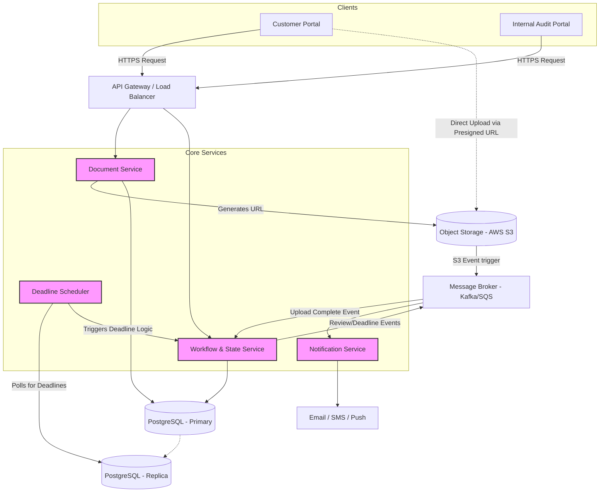

# System Design: Document Upload and Review System (HLD)

## 1. Overview & High-Level Architecture

### Core Requirements
**Functional:**
1. Users upload documents of any size.
2. Internal audit team manually reviews the documents.
3. Internal audit team receives notifications when a document review deadline approaches.
4. Customers are notified of the review outcome (Approved/Rejected).
5. Customers can re-upload or cancel reviews based on outcomes.

**Non-Functional:**
1. **High Scalability & Availability:** Must handle massive file uploads without degrading application server performance.
2. **Fault Tolerance:** System must not lose documents or drop notifications.

### MVP Architecture Diagram


## 2. Component Deep Dive & Core Workflows

---

### Core Components

* **API Gateway**: Handles authentication, rate limiting, and routes requests to appropriate backend services.
* **Document Service**: Responsible for file metadata and orchestrating the upload process. Crucially, it **does not process the file bytes directly**, which protects the system from memory exhaustion and network bottlenecks.
* **Object Storage (AWS S3 / GCS)**: Stores the actual document blobs. Highly scalable, durable, and natively supports large files and multipart uploads.
* **Workflow & State Service**: The "state machine" of the system. It tracks the lifecycle of a document (e.g., `PENDING_UPLOAD`, `IN_REVIEW`, `APPROVED`, `REJECTED`, `CANCELED`).
* **Deadline Scheduler**: Constantly checks for documents approaching their SLA/deadline and triggers alerts via the notification system.
* **Message Broker (Kafka / SQS)**: Decouples services. Used for asynchronous event processing (e.g., notifying the system when an S3 upload finishes, or queuing emails).
* **Notification Service**: Listens to events from the message broker and formats them into emails, in-app notifications, or Slack messages for both customers and internal auditors.

---

### Core Workflows

#### A. Handling "Any Size" Document Uploads
Passing huge files (e.g., 5GB PDFs or zips) through backend application servers causes network saturation and out-of-memory (OOM) errors. We solve this using the **Presigned URL pattern**:

1.  **Client** calls `POST /documents` with metadata (filename, size).
2.  **Document Service** creates a DB record with status `PENDING_UPLOAD`.
3.  **Document Service** requests a Presigned URL from S3 and returns it to the client.
4.  **Client** uploads the file bytes directly to S3 using the URL.
5.  **S3** fires an event to the Message Broker upon successful upload.
6.  **Workflow Service** consumes the event, updates the DB status to `IN_REVIEW`, and sets the `deadline_at` timestamp.

#### B. Deadline Tracking System
To efficiently track deadlines among millions of documents:

1.  We index the `documents` table on `(status, deadline_at)`.
2.  The **Deadline Scheduler** queries the Read Replica:
    ```sql
    SELECT id 
    FROM documents 
    WHERE status = 'IN_REVIEW' 
      AND deadline_at <= NOW() + INTERVAL '24 HOURS' 
      AND deadline_notified = FALSE;
    ```
3.  It drops these document IDs into a **Kafka topic**.
4.  The **Notification Service** picks them up and alerts the audit team.

## 3. Detailed API Specifications

The APIs follow **RESTful principles**, utilizing JSON payloads and standard HTTP status codes.

---

### 3.1. Customer API: Initialize Document Upload
Initializes the upload process and generates a Presigned URL.

* **Endpoint:** `POST /api/v1/documents`
* **Headers:** `Authorization: Bearer <Customer_Token>`

**Request Body:**
```json
{
  "file_name": "employee_passport_2026.pdf",
  "file_size_bytes": 10485760,
  "document_type": "IDENTIFICATION",
  "mime_type": "application/pdf"
}
```
**Response (201 Created):**
```json
{
  "data": {
    "document_id": "d-8f7b2a9c-11e2",
    "status": "PENDING_UPLOAD",
    "upload_url": "[https://rippling-docs.s3.amazonaws.com/...&X-Amz-Signature=](https://rippling-docs.s3.amazonaws.com/...&X-Amz-Signature=)...",
    "upload_expires_in_seconds": 3600
  }
}
```
### 3.2. Customer API: Get Document Status
* **Endpoint:** `GET /api/v1/documents/{document_id}`
* **Headers:** `Authorization: Bearer <Customer_Token>`

**Response (200 OK):**

```json
{
  "data": {
    "document_id": "d-8f7b2a9c-11e2",
    "status": "APPROVED",
    "deadline_at": "2026-05-01T12:00:00Z",
    "review_comments": "All looks good.",
    "updated_at": "2026-04-27T10:15:00Z"
  }
}
```
### 3.3. Customer API: Re-upload / Rectify Document
Used when a document is rejected and the customer needs to upload a corrected version.

* **Endpoint:** `POST /api/v1/documents/{document_id}/reupload`

* **Headers:** `Authorization: Bearer <Customer_Token>`

**Request Body:**

```json
{
  "file_name": "employee_passport_2026_corrected.pdf",
  "file_size_bytes": 12000000,
  "mime_type": "application/pdf"
}
```
**Response (200 OK):**

```json
{
  "data": {
    "document_id": "d-8f7b2a9c-11e2",
    "status": "PENDING_UPLOAD",
    "upload_url": "[https://rippling-docs.s3.amazonaws.com/...(new_url)](https://rippling-docs.s3.amazonaws.com/...(new_url))",
    "message": "Previous file invalidated. Please upload the new file."
  }
}
```
### 3.4. Internal Audit API: Fetch Queue
Fetches a list of documents pending review, sorted by approaching deadlines.

* **Endpoint:** `GET /api/internal/documents`
* **Query Parameters:** `?status=IN_REVIEW&sort_by=deadline_at:asc&limit=50`
* **Headers:** `Authorization: Bearer <Auditor_Token>`

**Response (200 OK):**

```json
{
  "data": [
    {
      "document_id": "d-12345678",
      "document_type": "W4_FORM",
      "status": "IN_REVIEW",
      "deadline_at": "2026-04-28T10:00:00Z",
      "time_remaining_hours": 24
    }
  ]
}
```
### 3.5. Internal Audit API: Submit Review
Submits the final decision on a document. This API is idempotent.

* **Endpoint:** `POST /api/internal/documents/{document_id}/reviews`

* **Headers:** `Authorization: Bearer <Auditor_Token>`

**Request Body:**

```json
{
  "outcome": "REJECTED",
  "comments": "The signature on page 2 is missing. Please sign and re-upload.",
  "auditor_id": "a-554433"
}
```

**Response (201 Created):**

```json
{
  "data": {
    "document_id": "d-12345678",
    "status": "REJECTED",
    "review_id": "r-999888",
    "message": "Review submitted successfully. Customer will be notified."
  }
}
```
