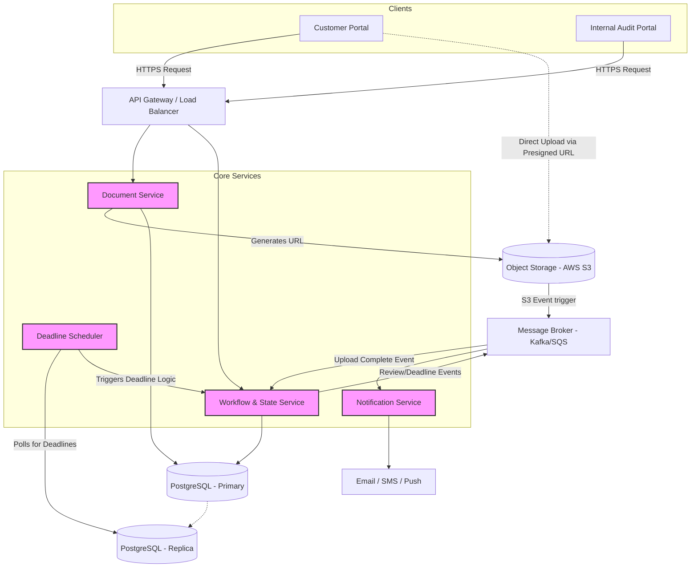
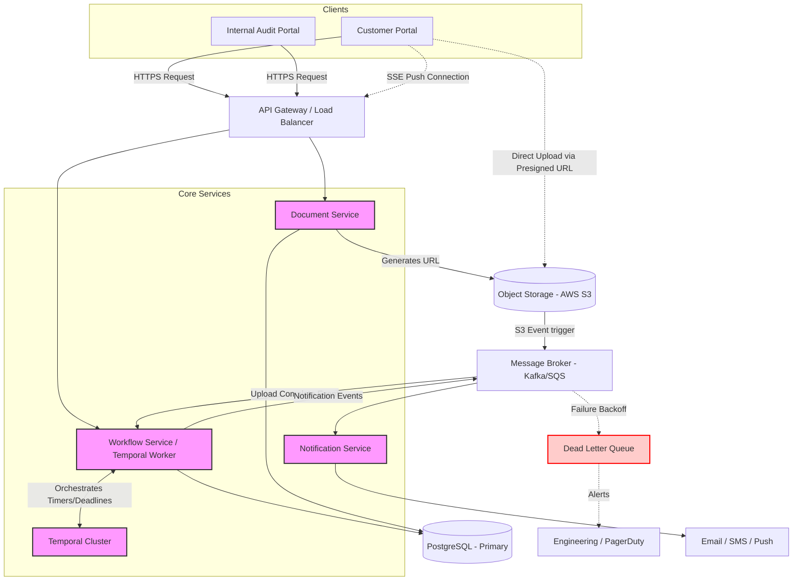

# System Design: Document Upload and Review System (HLD)

## 1. Overview & High-Level Architecture

### Core Requirements
**Functional:**
1. Users upload documents of any size.
2. Internal audit team manually reviews the documents.
3. Internal audit team receives notifications when a document review deadline approaches.
4. Customers are notified of the review outcome (Approved/Rejected).
5. Customers can re-upload or cancel reviews based on outcomes.

**Non-Functional:**
1. **High Scalability & Availability:** Must handle massive file uploads without degrading application server performance.
2. **Fault Tolerance:** System must not lose documents or drop notifications.

### MVP Architecture Diagram


## 2. Component Deep Dive & Core Workflows

---

### Core Components

* **API Gateway**: Handles authentication, rate limiting, and routes requests to appropriate backend services.
* **Document Service**: Responsible for file metadata and orchestrating the upload process. Crucially, it **does not process the file bytes directly**, which protects the system from memory exhaustion and network bottlenecks.
* **Object Storage (AWS S3 / GCS)**: Stores the actual document blobs. Highly scalable, durable, and natively supports large files and multipart uploads.
* **Workflow & State Service**: The "state machine" of the system. It tracks the lifecycle of a document (e.g., `PENDING_UPLOAD`, `IN_REVIEW`, `APPROVED`, `REJECTED`, `CANCELED`).
* **Deadline Scheduler**: Constantly checks for documents approaching their SLA/deadline and triggers alerts via the notification system.
* **Message Broker (Kafka / SQS)**: Decouples services. Used for asynchronous event processing (e.g., notifying the system when an S3 upload finishes, or queuing emails).
* **Notification Service**: Listens to events from the message broker and formats them into emails, in-app notifications, or Slack messages for both customers and internal auditors.

---

### Core Workflows

#### A. Handling "Any Size" Document Uploads
Passing huge files (e.g., 5GB PDFs or zips) through backend application servers causes network saturation and out-of-memory (OOM) errors. We solve this using the **Presigned URL pattern**:

1.  **Client** calls `POST /documents` with metadata (filename, size).
2.  **Document Service** creates a DB record with status `PENDING_UPLOAD`.
3.  **Document Service** requests a Presigned URL from S3 and returns it to the client.
4.  **Client** uploads the file bytes directly to S3 using the URL.
5.  **S3** fires an event to the Message Broker upon successful upload.
6.  **Workflow Service** consumes the event, updates the DB status to `IN_REVIEW`, and sets the `deadline_at` timestamp.

#### B. Deadline Tracking System
To efficiently track deadlines among millions of documents:

1.  We index the `documents` table on `(status, deadline_at)`.
2.  The **Deadline Scheduler** queries the Read Replica:
    ```sql
    SELECT id 
    FROM documents 
    WHERE status = 'IN_REVIEW' 
      AND deadline_at <= NOW() + INTERVAL '24 HOURS' 
      AND deadline_notified = FALSE;
    ```
3.  It drops these document IDs into a **Kafka topic**.
4.  The **Notification Service** picks them up and alerts the audit team.

## 3. Detailed API Specifications

The APIs follow **RESTful principles**, utilizing JSON payloads and standard HTTP status codes.

---

### 3.1. Customer API: Initialize Document Upload
Initializes the upload process and generates a Presigned URL.

* **Endpoint:** `POST /api/v1/documents`
* **Headers:** `Authorization: Bearer <Customer_Token>`

**Request Body:**
```json
{
  "file_name": "employee_passport_2026.pdf",
  "file_size_bytes": 10485760,
  "document_type": "IDENTIFICATION",
  "mime_type": "application/pdf"
}
```
**Response (201 Created):**
```json
{
  "data": {
    "document_id": "d-8f7b2a9c-11e2",
    "status": "PENDING_UPLOAD",
    "upload_url": "[https://rippling-docs.s3.amazonaws.com/...&X-Amz-Signature=](https://rippling-docs.s3.amazonaws.com/...&X-Amz-Signature=)...",
    "upload_expires_in_seconds": 3600
  }
}
```
### 3.2. Customer API: Get Document Status
* **Endpoint:** `GET /api/v1/documents/{document_id}`
* **Headers:** `Authorization: Bearer <Customer_Token>`

**Response (200 OK):**

```json
{
  "data": {
    "document_id": "d-8f7b2a9c-11e2",
    "status": "APPROVED",
    "deadline_at": "2026-05-01T12:00:00Z",
    "review_comments": "All looks good.",
    "updated_at": "2026-04-27T10:15:00Z"
  }
}
```
### 3.3. Customer API: Re-upload / Rectify Document
Used when a document is rejected and the customer needs to upload a corrected version.

* **Endpoint:** `POST /api/v1/documents/{document_id}/reupload`

* **Headers:** `Authorization: Bearer <Customer_Token>`

**Request Body:**

```json
{
  "file_name": "employee_passport_2026_corrected.pdf",
  "file_size_bytes": 12000000,
  "mime_type": "application/pdf"
}
```
**Response (200 OK):**

```json
{
  "data": {
    "document_id": "d-8f7b2a9c-11e2",
    "status": "PENDING_UPLOAD",
    "upload_url": "[https://rippling-docs.s3.amazonaws.com/...(new_url)](https://rippling-docs.s3.amazonaws.com/...(new_url))",
    "message": "Previous file invalidated. Please upload the new file."
  }
}
```
### 3.4. Internal Audit API: Fetch Queue
Fetches a list of documents pending review, sorted by approaching deadlines.

* **Endpoint:** `GET /api/internal/documents`
* **Query Parameters:** `?status=IN_REVIEW&sort_by=deadline_at:asc&limit=50`
* **Headers:** `Authorization: Bearer <Auditor_Token>`

**Response (200 OK):**

```json
{
  "data": [
    {
      "document_id": "d-12345678",
      "document_type": "W4_FORM",
      "status": "IN_REVIEW",
      "deadline_at": "2026-04-28T10:00:00Z",
      "time_remaining_hours": 24
    }
  ]
}
```
### 3.5. Internal Audit API: Submit Review
Submits the final decision on a document. This API is idempotent.

* **Endpoint:** `POST /api/internal/documents/{document_id}/reviews`

* **Headers:** `Authorization: Bearer <Auditor_Token>`

**Request Body:**

```json
{
  "outcome": "REJECTED",
  "comments": "The signature on page 2 is missing. Please sign and re-upload.",
  "auditor_id": "a-554433"
}
```

**Response (201 Created):**

```json
{
  "data": {
    "document_id": "d-12345678",
    "status": "REJECTED",
    "review_id": "r-999888",
    "message": "Review submitted successfully. Customer will be notified."
  }
}
```
## 4. Persistence & Data Model

We use **PostgreSQL** as our primary relational database to ensure strict ACID transactions and maintain relational integrity between Users, Documents, and Review events.

---

### 4.1. Table: `users`
Stores information for both Customers and Auditors.

| Column | Type | Constraints |
| :--- | :--- | :--- |
| `id` | UUID | Primary Key |
| `email` | VARCHAR | Unique, Not Null |
| `role` | VARCHAR | ENUM ('CUSTOMER', 'AUDITOR') |

---

### 4.2. Table: `documents`
The central table for tracking document metadata and lifecycle state.

| Column | Type | Constraints | Notes |
| :--- | :--- | :--- | :--- |
| `id` | UUID | Primary Key | |
| `customer_id` | UUID | Foreign Key | Indexed for fast lookups by user. |
| `document_type` | VARCHAR | Not Null | e.g., 'PASSPORT', 'W4' |
| `s3_bucket_key` | VARCHAR | Not Null | Path to the actual file blob in S3. |
| `status` | VARCHAR | ENUM | PENDING_UPLOAD, IN_REVIEW, APPROVED, REJECTED, CANCELED |
| `created_at` | TIMESTAMP | DEFAULT NOW() | |
| `updated_at` | TIMESTAMP | DEFAULT NOW() | |
| `deadline_at` | TIMESTAMP | | Indexed with `status` for deadline tracking. |
| `deadline_notified`| BOOLEAN | DEFAULT FALSE | Prevents duplicate alerts for the same deadline. |

---

### 4.3. Table: `reviews` (Audit Trail)
Acts as an **append-only** audit log for compliance and historical tracking.

| Column | Type | Constraints |
| :--- | :--- | :--- |
| `id` | UUID | Primary Key |
| `document_id` | UUID | Foreign Key |
| `auditor_id` | UUID | Foreign Key |
| `outcome` | VARCHAR | ENUM ('APPROVED', 'REJECTED') |
| `comments` | TEXT | |
| `created_at` | TIMESTAMP | DEFAULT NOW() |

## 5. Architecture Decisions & Trade-offs

This section outlines the critical design choices made for the Document Lifecycle system, comparing alternative approaches and detailing the final decisions based on scalability and compliance requirements.

---

### Trade-off 1: Cron Scheduler vs. Distributed Workflow Orchestrator (Temporal)

**Where it fits:** Deadline Scheduler and Workflow & State Service.

#### The Problem
Documents have a strict "time to review" (SLA). We need a reliable mechanism to trigger an alert exactly 24 hours before the deadline expires.

#### Approach A: Cron Job + DB Polling (Simpler)
* **Design**: A scheduled worker runs every 5 minutes and queries the Read Replica.
    ```sql
    SELECT id FROM documents 
    WHERE deadline < NOW() + INTERVAL '24 HOURS' 
    AND status = 'IN_REVIEW' 
    AND deadline_notified = FALSE;
    ```
* **Pros**: Easy to build; utilizes standard infrastructure (Postgres, Cron).
* **Cons**: Scaling issues with millions of rows; potential for missed windows if the job crashes; creates "thundering herd" spikes on the database every 5 minutes.

#### Approach B: Distributed Orchestrator (Temporal/Cadence)
* **Design**: When a document enters `IN_REVIEW`, a stateful workflow starts. The logic uses a durable timer: `sleep(deadline - 24 hours); sendNotification();`.
* **Pros**: Extremely scalable; handles millions of concurrent timers; implicit retries and state persistence.
* **Cons**: High operational overhead to maintain a Temporal cluster.

**Conclusion**: For a startup, **Approach A** is sufficient. For a massive enterprise like Rippling with strict compliance SLAs, **Approach B** is the standard and replaces the standalone Deadline Scheduler entirely.

---

### Trade-off 2: Client-side Polling vs. Server-Sent Events (SSE)

**Where it fits**: Connection between the Customer Portal (Client) and API Gateway.

#### The Problem
Since the client uploads massive files directly to S3, the browser needs a way to know when the backend has successfully processed the S3 event and updated the document status to `IN_REVIEW`.

#### Approach A: Client Polling
* **Design**: The frontend calls `GET /api/v1/documents/{id}` every 3 seconds until the status changes.
* **Pros**: Simplest to implement; stateless backend.
* **Cons**: Wasteful network traffic; can overload the API Gateway and Database with redundant read requests.

#### Approach B: Server-Sent Events (SSE)
* **Design**: The client establishes a one-way SSE connection. When the Workflow Service processes the Kafka event from S3, it pushes the update directly to the client.
* **Pros**: Immediate updates; superior UX; significantly lower API and DB load.
* **Cons**: Requires persistent connections; slightly more complex load balancing.

**Conclusion**: **Use SSE**. It is perfectly suited for one-way server-to-client notifications (unlike the overhead of bi-directional WebSockets) and drastically reduces system-wide load.

---

### Trade-off 3: Ensuring Fault Tolerance with Dead Letter Queues (DLQs)

**Where it fits**: Between the Message Broker (Kafka/SQS) and the Notification Service.

#### The Problem
If a 3rd-party provider (e.g., SendGrid) is down, we cannot afford to lose critical approval or rejection notifications.

#### Implementation Strategy: At-Least-Once Delivery
1.  The **Notification Service** consumes a message from the broker.
2.  If the email fails to send, the message is **not** acknowledged.
3.  The broker retries with **exponential backoff** (e.g., 1m, 5m, 15m).
4.  After 5 failed attempts, the message is moved to a **Dead Letter Queue (DLQ)**.
5.  **Engineering Alerts**: DLQ activity triggers a PagerDuty alert for manual intervention to ensure no notification is lost.

---

### Trade-off 4: Data Deletion Strategy (Soft vs. Hard Deletes)

**Where it fits**: Primary Database and Object Storage (S3).

#### The Problem
Handling "Cancel Review" requests or document rejections in a way that balances user privacy with regulatory compliance.

#### Implementation Strategy
In the HR and Compliance domain, immediate hard deletion is risky due to accidental clicks and the necessity of audit trails.

* **Database (PostgreSQL)**: We use **Soft Deletes**. Rows are updated to `status = 'CANCELED'` with a timestamp. This preserves the audit trail for compliance teams.
* **Object Storage (S3)**: We utilize **S3 Lifecycle Policies**.
    * **30 Days**: Move canceled/rejected files to a cheaper tier (**S3 Glacier**).
    * **90 Days**: Permanently **Hard-Delete** the files to remain compliant with GDPR/CCPA "Right to Erasure" regulations.

## 6. The Evolution: MVP to Enterprise Scale

In a standard startup environment, we would deploy a Minimum Viable Product (MVP) architecture. However, at Rippling's enterprise scale (millions of documents, strict compliance SLAs, massive traffic spikes), the MVP architecture introduces critical bottlenecks. Here is a deep dive into the MVP components and exactly *how* and *why* we are upgrading them.

### A. Deadline Tracking
*   **MVP Component (Cron Scheduler):** A standard cron job runs every 5 minutes, querying a Postgres Read Replica to find documents where `deadline < NOW() + 24hr`.
*   **The Bottleneck:** As the table grows to millions of rows, polling creates "thundering herd" spikes of database load and expensive table scans. If the cron worker crashes, SLAs are missed.
*   **Enterprise Upgrade (Temporal / Cadence):** We replace the Cron Scheduler entirely with a distributed workflow orchestrator like **Temporal**. When a document enters `IN_REVIEW`, Temporal starts a stateful workflow holding a timer in memory (`sleep(deadline - 24 hours)`). This removes all DB polling and guarantees execution at exact milliseconds across a distributed cluster.

### B. Client Real-Time Updates
*   **MVP Component (Client Polling):** After a customer uploads a large file directly to S3, their browser calls `GET /documents/{id}` every 3 seconds to check if the backend has registered the file.
*   **The Bottleneck:** This generates massive, wasteful network traffic and overloads the API Gateway and Database with useless reads.
*   **Enterprise Upgrade (Server-Sent Events - SSE):** We upgrade to a push-model. The client establishes a one-way persistent **SSE connection** during upload. When the backend processes the S3 upload event, it pushes the state change down the open pipeline, providing instant UX with minimal server overhead.

### C. Fault Tolerance & Delivery Guarantees
*   **MVP Component (Basic Message Broker):** A standard queue passes events to the Notification Service to send emails via SendGrid/SES.
*   **The Bottleneck:** If the 3rd-party email provider has an outage, the message fails, is discarded, and the customer is never notified of their approval/rejection.
*   **Enterprise Upgrade (Dead Letter Queues - DLQ):** We implement At-Least-Once delivery. If an email fails, the broker retries with exponential backoff. If it fails repeatedly, it moves to a **DLQ**. This triggers an automated PagerDuty alert to Engineering to manually intervene. No notification is ever lost.

### D. Data Deletion & Compliance
*   **MVP Component (Hard Deletes):** When a user cancels a review, the application issues a `DELETE` SQL statement and immediately deletes the S3 object.
*   **The Bottleneck:** In the HR domain, accidental hard-deletions destroy critical audit trails and violate compliance norms.
*   **Enterprise Upgrade (Soft Deletes + S3 Lifecycle Policies):** The DB uses soft deletes (`status = 'CANCELED'`). We rely entirely on AWS S3 Lifecycle Policies to automatically transition canceled/rejected files to Glacier (cold storage) after 30 days, and hard-delete them after 90 days for GDPR/CCPA compliance.

---

## 7. Enterprise Architecture Diagram

*This diagram reflects the upgraded enterprise state, featuring Temporal orchestration, SSE push connections, and Dead Letter Queues.*

