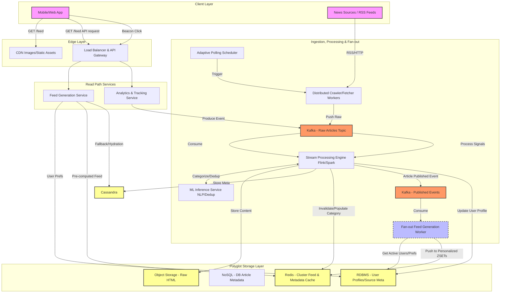

# System Design: Real-Time News Aggregator

## 1. Deconstructing the Requirements
Before we draw a single box, let's look at our constraints.

### Functional Requirements
* **Ingestion:** Aggregate from thousands of RSS feeds and raw web crawls.
* **Consumption:** Real-time, personalized, infinite-scrolling feed.
* **Handoff:** Redirect users to the third-party publisher upon clicking an article.
* **Enrichment:** Automatically categorize news articles (e.g., Sports, Politics, Tech).

### Non-Functional Requirements
* **Speed:** Sub-100ms latency for fetching the news feed.
* **Resilience:** Highly available and scalable (expecting millions of Daily Active Users).

> **Senior Insight:**
> The "Redirect to third party" requirement is a massive architectural gift. It means we don't need to serve the full text of the article to the user. Our read path only needs to return metadata: `Title, Thumbnail, Snippet, Publisher, and the Source URL`.
> 
> This drastically shrinks our serving payload and cache memory requirements.

---

## 2. The Ingestion Pipeline: Catching the Firehose
Our system needs to ingest data from thousands of sources continuously. We cannot rely on a synchronous, monolithic scraper. We need a decoupled, asynchronous pipeline.

### The Architecture
* **Feed Fetcher / Crawler Service:** A distributed cluster of workers (e.g., built in Go for high concurrency) scheduled by a distributed cron system (like Airflow or Cadence). They poll RSS feeds or scrape designated seed URLs.
* **Raw Content Queue:** The fetchers dump the raw HTML/XML payloads into a message broker. **Apache Kafka** is the standard choice here due to its high throughput, durability, and support for replayability.
* **Processing Consumers:** Flink or Spark Streaming consumers read from Kafka to process the raw text.

#### Trade-off: Polling Frequency vs. System Load
> "Polling a small local blog every 5 minutes is a waste of resources, but polling CNN every hour means our 'real-time' system is woefully outdated."

**Decision:** Implement an **Adaptive Polling Schedule**. We track the publication frequency of each source. High-frequency sources (like Reuters) get polled every 1-2 minutes. Low-frequency sources get polled every few hours. We store this polling metadata in a fast RDBMS like PostgreSQL.

---

## 3. The Processing Engine: Making Sense of the Noise
Once we have the raw text, we must clean it, categorize it, and ensure we aren't showing the user the exact same story from five different publishers.

### Deduplication (The Near-Duplicate Problem)
News agencies often syndicate articles. Standard cryptographic hashes (like SHA-256) fail here because a single changed comma changes the entire hash.

* **Tech Choice:** SimHash or MinHash (Locality-Sensitive Hashing). These algorithms generate similar hashes for similar documents. If the Hamming distance between two hashes is below a certain threshold, we group them into a single "Story Cluster."

### Categorization & Enrichment
We pass the cleaned text through an NLP/ML service.

1. **Pipeline:** Extract keywords.
2. **NER:** Run Named Entity Recognition to find people and places.
3. **Classifier:** Use a fine-tuned BERT model to tag the article with categories (e.g., Tech, AI, Startups).

**Decision:** We only run heavy ML models asynchronously during ingestion, never on the user's read path. The output metadata is written to the database.

---

## 4. The Storage Layer: Polyglot Persistence
We have different access patterns for different types of data, which mandates a specific persistence strategy.

| Data Type | Tool | Purpose |
| :--- | :--- | :--- |
| **Raw Article Storage** | Amazon S3 | Compliance, model retraining, and debugging. |
| **Article Metadata** | Cassandra / DynamoDB | High write throughput and fast reads by ID. |
| **User Profiles & Graph** | PostgreSQL | Relational mapping of preferences and followed topics. |
| **Feed Cache** | Redis Cluster | Crucial for sub-100ms latency requirement. |

---

## 5. Feed Generation & Personalization
How do we generate a real-time, infinite-scrolling feed personalized to a user's tastes?

### The Winning Approach: Hybrid Model (Push + Pull)
* **Active Users:** For users who log in daily, we maintain a pre-computed "Home Feed" in Redis. We use an asynchronous worker that periodically updates this feed using a lightweight ML Ranking Model.
* **Inactive Users:** We do not pre-compute feeds for users who haven't logged in for a week. We generate their feed on the fly (Pull) upon their next login, caching it thereafter.
* **Global Popular News:** Breaking news is kept in a global Redis cache. The user's final feed is a quick merge of their **Personal Redis Feed + The Global Trending Feed**.

### Infinite Scrolling
* **Tech Choice:** **Cursor-based Pagination**. Offset-based pagination gets extremely slow for deep scrolls and suffers from duplicate items. Cursor-based pagination (using the article's timestamp) guarantees $O(1)$ performance.

---

## 6. The Serving Layer & Handoff
To achieve < 100ms latency:
1. **Client Request:** Hits the CDN (CloudFront) for static assets.
2. **API Gateway:** Handles rate-limiting and auth.
3. **Feed Service:** Fetches the pre-ranked list of Article IDs from Redis.
4. **Hydration:** Service fetches metadata (Title, Snippet, URL) from a secondary Redis cache.
5. **Response:** JSON payload returned to the user (~30-50ms).

### Handling Clicks (The Handoff)
1. **Redirect:** The client redirects the browser to the third-party URL.
2. **Analytics:** The client fires an asynchronous beacon event to our API.
3. **Processing:** A stream processor consumes this to update the article's CTR and the user's ML preference profile in the background.

---

## 7. Fault Tolerance & Resiliency
* **Ingestion Safety:** Rate limiting at the Ingestion Gateway per domain prevents rogue RSS sources from overwhelming the system.
* **Graceful Degradation:** If Redis goes down, the Feed Service falls back to Cassandra. Latency will spike to ~200ms, but the system remains available.

# Data Layer & Caching Strategies

Structuring the data correctly is the backbone of the news aggregator, directly dictating how well the system scales under load. We utilize a polyglot persistence approach, meaning we use different database engines tailored to specific access patterns.

---

## 1. Core Entities and Database Models

### A. PostgreSQL (Relational Data)
Relational databases are perfect for data with complex relationships, low write volume, and high transactional requirements.

**Table: `Users`**
*   **`user_id`** (UUID, Primary Key)
*   **`email`** (String, Indexed)
*   **`followed_categories`** (Array of Strings)
*   **`blocked_sources`** (Array of Strings)
*   **`created_at`** (Timestamp)

**Table: `News_Sources`**
*   **`source_id`** (UUID, Primary Key)
*   **`domain_url`** (String, Indexed)
*   **`name`** (String)
*   **`polling_frequency_minutes`** (Integer)
*   **`trust_score`** (Float)

### B. Cassandra / DynamoDB (Article Metadata)
This is our heavy lifter. It stores the metadata required to render the feed. 

**Table: `Articles_By_Category`**
*   **`partition_key`:** `category#YYYY-MM-DD` (String) - *Prevents hot partitions while grouping data temporally.*
*   **`sort_key`:** `published_at` (Timestamp) - *Ensures chronological sorting out of the box.*
*   **`article_id`** (UUID)
*   **`source_id`** (UUID)
*   **`title`** (String)
*   **`snippet`** (String)
*   **`thumbnail_url`** (String)
*   **`publisher_url`** (String)
*   **`simhash`** (String) - *For deduplication tracking.*

---

## 2. DynamoDB & Cassandra vs. MongoDB

Why choose wide-column stores (Cassandra) or massive key-value stores (DynamoDB) over a document database like MongoDB for the article metadata?

*   **The Write Firehose:** News aggregation is an inherently write-heavy system. Thousands of articles are ingested per minute globally. Cassandra (using Log-Structured Merge-Trees) and DynamoDB are optimized for continuous, massive-scale writes across distributed nodes. Wide-column stores edge out traditional document stores in pure distributed write-throughput without complex sharding setups.
*   **Time-Series Access Patterns:** Our read query is almost always: *"Give me the most recent articles for Category X."* DynamoDB and Cassandra allow us to define a Partition Key (`category#date`) and a Sort Key (`timestamp`). This turns our queries into highly localized, sequential disk reads (O(1) lookup + sequential scan). 
*   **No Complex JSON Needs:** MongoDB shines when you have highly polymorphic, deeply nested data that you want to query across flexible fields. Our article metadata is highly structured and flat. We don't need MongoDB's primary strength, but we desperately need Cassandra/DynamoDB's sheer speed for time-series data.

---

## 3. Redis Cache Key-Value Relationships

To achieve our sub-100ms latency, we rely heavily on Redis. 

### A. The Feeds (Sorted Sets - ZSET)
Sorted sets maintain an ordered list by a "score" (the UNIX timestamp or a computed ML rank).

*   **Key:** `global_trending`
    *   **Score:** Time-decayed popularity score
    *   **Value:** `article_id`
*   **Key:** `category_feed:{category_name}` (e.g., `category_feed:tech`)
    *   **Score:** `published_at` (UNIX Timestamp)
    *   **Value:** `article_id`
*   **Key:** `user_feed:{user_id}` (Pre-computed for active users)
    *   **Score:** ML Ranking Score
    *   **Value:** `article_id`

### B. The Hydration Cache (Hashes - HSET)
Once the Feed Service gets a list of `article_ids` from a ZSET, it needs the actual text to send to the UI.

*   **Key:** `article_meta:{article_id}`
    *   **Field/Values:** `title` -> "...", `url` -> "...", `thumbnail` -> "..."
    *   *TTL (Time To Live):* 7 days (news ages quickly).

---

## 4. Caching Strategies: Ingestion vs. Fan-out

Caching happens asynchronously to keep the user's read path as lightweight as possible. 

### During Ingestion
The **Stream Processing Engine (Flink/Spark)** or a dedicated **Ingestion Worker** is responsible for the initial caching. Once an article is cleaned, deduplicated, and written to Cassandra, the same worker performs a write-through to Redis:
1.  Sets the HSET `article_meta:{article_id}`.
2.  Adds the `article_id` to the ZSET `category_feed:{category}`.

### During Fan-Out (Personalization)
A separate background service—the **Fan-out Feed Generation Worker**—handles the fan-out logic. 
1.  It listens to a Kafka topic for "New Article Published" events.
2.  It cross-references the article's category against a cache of currently active users who follow that category.
3.  It pushes the `article_id` directly into those users' specific `user_feed:{user_id}` ZSETs, updating their pre-computed feeds in real-time.

## 5. Cache Eviction Strategies

Memory in Redis is expensive, and news aggregation generates a continuous, endless stream of data. If we do not explicitly define eviction policies, our cache will run out of memory (OOM) and crash the read path. We must apply specific eviction strategies tailored to each data structure's access pattern.

### A. Global Trending Feed (`global_trending` ZSET)
*   **Strategy:** **Time-Based Sliding Window.**
    *   A background cron job runs every minute, executing `ZREMRANGEBYSCORE global_trending -inf (current_time - 24_hours)`.
*   **Justification:** The definition of "trending" is highly temporal. Articles older than 24 hours are functionally dead for a breaking news feed. By aggressively trimming by timestamp score, we keep this highly-accessed ZSET small and performant.

### B. Category Feeds (`category_feed:{category_name}` ZSET)
*   **Strategy:** **Capacity-Based Trimming on Write.**
    *   Every time the Ingestion Worker adds a new article ID to a category feed, it immediately runs a trim command to keep only the newest `N` items: `ZREMRANGEBYRANK category_feed:{category} 0 -10001`.
*   **Justification:** While users can infinitely scroll, statistically, no user scrolls past 10,000 articles in a single session. Caching a million "sports" articles from 2015 is a waste of RAM. Trimming on write ensures O(1) bound memory per category.

### C. Personalized User Feeds (`user_feed:{user_id}` ZSET)
*   **Strategy:** **Inactivity TTL + Capacity Limits.**
    *   **Capacity:** Trimmed to a max of 1,000 items on every new push.
    *   **TTL:** Every time the user logs in and fetches their feed, we reset a Time-To-Live (TTL) of 7 days on this key (`EXPIRE user_feed:{user_id} 604800`).
*   **Justification:** This is our largest memory sink, as it scales linearly with Active Users. If a user goes on vacation and doesn't open the app for a week, their pre-computed feed is automatically purged. When they return, they hit the "Inactive User" fallback path (Cassandra/Postgres pull), which regenerates their feed and cache.

### D. Article Metadata (`article_meta:{article_id}` HSET)
*   **Strategy:** **Absolute TTL + Global LRU Eviction.**
    *   **Absolute TTL:** Set a hard 7-day expiration when the key is created (`EXPIRE article_meta:{id} 604800`).
    *   **Global Fallback:** The Redis cluster itself is configured with an `allkeys-lru` maxmemory policy.
*   **Justification:** News has a notoriously short shelf life. 99% of reads happen within the first 48 hours of publication. A 7-day TTL covers almost all organic feed scrolls. The `allkeys-lru` policy acts as a safety net: if a massive global news event causes a massive spike in ingestion that threatens the RAM limits before TTLs expire, Redis will gracefully evict the oldest, least-read article metadata to survive the spike.
