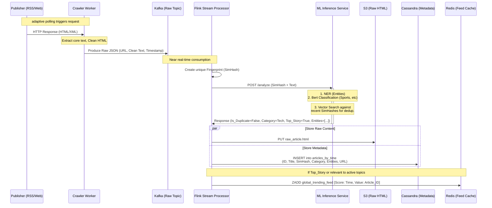

# The Ingestion Path: Pipeline & Component Deep Dive

The ingestion pipeline is a highly concurrent, asynchronous, and fault-tolerant system designed to ingest millions of news articles daily. Its primary goal is to fetch raw content, sanitize it, deduplicate it into cohesive "Story Clusters," categorize it using Machine Learning, and rapidly populate our caches for sub-100ms read access.

---

## 1. Adaptive Polling Scheduler & Crawler Workers

We cannot continuously poll 100,000 RSS feeds simultaneously without getting IP-banned or wasting immense compute resources on idle blogs. We use an **Adaptive Polling Strategy**.

*   **The Scheduler (Temporal / Cadence):** A distributed workflow engine maintains a schedule for every known news source.
*   **Dynamic Polling Frequency:** The polling interval is dynamically calculated based on historical publication frequency.
    *   *High-Volume Sources (e.g., Reuters, CNN):* Polled every 1 to 2 minutes.
    *   *Low-Volume Sources (e.g., niche tech blogs):* Polled every 4 to 12 hours.
*   **Crawler Workers (Go/Rust):** When the scheduler triggers a poll, an asynchronous worker grabs the task. It fetches the RSS XML or scrapes the seed URL, extracts the newly published URLs, and downloads the raw HTML payloads.

---

## 2. The Message Broker: Kafka Ingestion Topics

Crawler workers do not process the data; they simply dump it into a message broker to decouple fetching from heavy processing.

*   **Topic Name:** `raw_articles_ingestion`
*   **Partitioning Strategy:** Partitioned by `source_id`. This ensures that articles from the same publisher are processed sequentially, preventing race conditions if a publisher updates an article immediately after publishing it.
*   **Retention Policy:** 48 hours. This allows us to replay the stream and recover data if the downstream ML pipeline experiences a catastrophic failure.
*   **Message Schema (JSON):**
    ```json
    {
      "source_id": "uuid",
      "raw_url": "https://...",
      "html_payload": "<html>...",
      "fetched_at": "2024-05-20T12:00:00Z"
    }
    ```

---

## 3. Stream Processing Engine (Apache Flink)

Flink consumers continuously read from the Kafka partitions. Flink handles the heavy lifting of stateful stream processing.

*   **HTML Extraction:** Flink runs the raw HTML through a DOM parser (similar to Mozilla's Readability) to strip away ads, navbars, and boilerplate, extracting only the Title, Core Text, and Thumbnail URL.
*   **SimHash Generation:** Before invoking heavy ML models, Flink calculates a **SimHash** (a Locality-Sensitive Hash) of the core text. Unlike cryptographic hashes (SHA-256) where a single changed comma alters the entire hash, SimHash ensures that documents with similar text generate similar hashes (measured via Hamming distance).

---

## 4. Machine Learning Inference Service

Flink makes an asynchronous gRPC call to the ML Inference cluster (often deployed on GPU-backed Kubernetes pods) passing the clean text and the SimHash.

*   **Categorization (NLP):** We use a lightweight Transformer model (e.g., **fine-tuned DistilBERT**). It is fast enough for real-time inference and accurately multi-classifies the text into categories (e.g., `Technology`, `Sports`, `Politics`).
*   **Named Entity Recognition (NER):** A library like spaCy extracts key entities (e.g., "Elon Musk", "Tesla", "California") to populate metadata tags for search and finer personalization.
*   **Duplicate Detection:** The ML service queries an in-memory vector database (or Redis) containing the SimHashes of all articles published in the last 48 hours. If the Hamming distance between the new SimHash and an existing one is below a strict threshold `ε`, it flags the article as a **Duplicate**.

---

## 5. The Clustering Engine (Handling Duplicates)

When the ML service flags a duplicate, we do not discard the article. We group them into a **Story Cluster**.

*   **First Article (The Pioneer):** If no SimHash match is found, the article gets a newly generated `Cluster_ID`.
*   **Subsequent Articles:** If a match is found, the new article inherits the existing `Cluster_ID`.

### Selecting the Canonical "Head" Article
For every `Cluster_ID`, the system must elect a "Default" article to display in global feeds. Flink calculates a heuristic score for the incoming article:
$$Score = (W_1 \times Trust\_Factor) + (W_2 \times Media\_Richness) - (W_3 \times Time\_Decay)$$
*   **Trust Factor:** AP News gets a higher weight than a random blog.
*   **Media Richness:** Penalize articles missing thumbnails or clear snippets.
*   **Time Decay:** Reward the publisher who broke the story first.

If the new article's score is higher than the current Head Article of that `Cluster_ID`, it usurps the position and updates the metadata record as the primary representative of that story.

---

## 6. Polyglot Storage & Redis Involvement

Once Flink and the ML/Clustering engines have finalized the article metadata, the ingestion pipeline fans out the writes to our storage and cache layers.

1.  **Cold Storage (S3):** The raw HTML payload is dumped to S3 for compliance, legal disputes, and offline ML model retraining.
2.  **Persistent Metadata (Cassandra):** The enriched JSON (containing `Cluster_ID`, Category, Entities, Snippet, URL) is written to Cassandra (`Articles_By_Category`).
3.  **Hot Cache Population (Redis):** This is critical for the sub-100ms read requirement. The ingestion worker performs a write-through directly to Redis:
    *   **HSET (`article_meta:{article_id}`):** Stores the display metadata (Title, Snippet, Image) with a 7-day TTL.
    *   **ZSET (`category_feed:{category}`):** If the article is the Head of a Cluster, its `Cluster_ID` is pushed into the category's sorted set, scored by timestamp.
    *   **Event Trigger:** Finally, Flink drops a small `Article_Published` event into a secondary Kafka topic. The **Fan-Out Worker** consumes this to push the `Cluster_ID` into the pre-computed Redis feeds of active users who follow that category.
