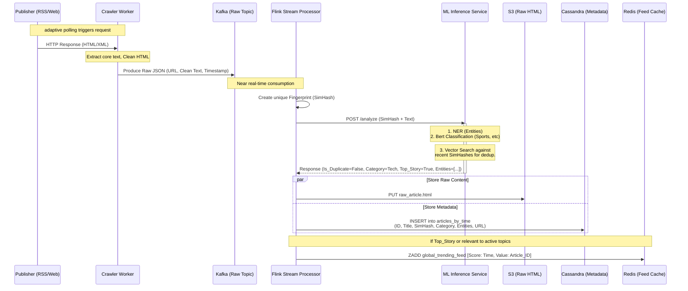

```mermaid
sequenceDiagram
    participant P as Publisher (RSS/Web)
    participant C as Crawler Worker
    participant K as Kafka (Raw Topic)
    participant F as Flink Stream Processor
    participant ML as ML Inference Service
    participant S3 as S3 (Raw HTML)
    participant DB as Cassandra (Metadata)
    participant R as Redis (Feed Cache)

    Note over P,C: adaptive polling triggers request
    P->>C: HTTP Response (HTML/XML)
    Note over C: Extract core text, Clean HTML
    C->>K: Produce Raw JSON (URL, Clean Text, Timestamp)
    
    Note over K,F: Near real-time consumption
    F->>F: Create unique Fingerprint (SimHash)
    
    F->>ML: POST /analyze (SimHash + Text)
    activate ML
    Note over ML: 1. NER (Entities)<br/>2. Bert Classification (Sports, etc)
    Note over ML: 3. Vector Search against<br/> recent SimHashes for dedup.
    ML-->>F: Response (Is_Duplicate=False, Category=Tech, Top_Story=True, Entities=[...])
    deactivate ML

    par Store Raw Content
        F->>S3: PUT raw_article.html
    and Store Metadata
        F->>DB: INSERT into articles_by_time<br/>(ID, Title, SimHash, Category, Entities, URL)
    end

    Note over F,R: If Top_Story or relevant to active topics
    F->>R: ZADD global_trending_feed [Score: Time, Value: Article_ID]
```
