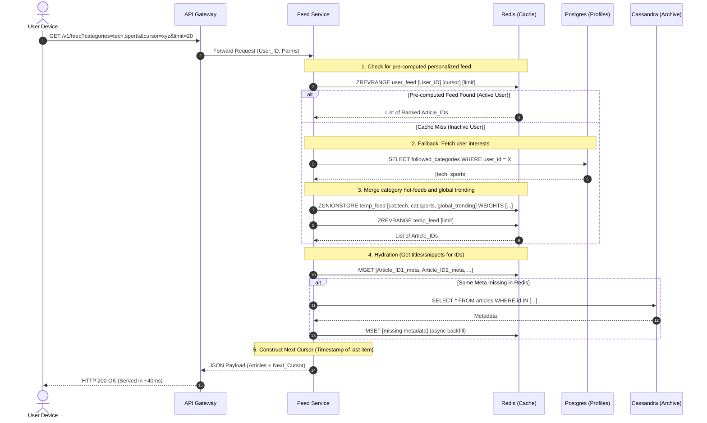

## API Specifications

**Base URL:** `https://api.googlenewsaggregator.com/v1`

### 1. Fetch Personalized News Feed
Provides an infinite scrolling list of news articles personalized to the user.

*   **Endpoint:** `GET /feed`
*   **Authentication:** Required (Bearer Token in Request Header)
*   **Query Parameters:**

| Parameter | Type | Required | Description |
| :--- | :--- | :--- | :--- |
| `cursor` | String | No | Encoded token for pagination. If omitted, returns page 1. Derived from the last item of previous response. |
| `limit` | Integer | No | Default: 20. Max: 50. Number of items per page. |
| `categories` | String | No | Comma-separated list (e.g., `tech,sports`). Overrides profile preferences for this request only. |
| `lang` | String | No | E.g., `en-US`. For localization. |

*   **Success Response (200 OK):**
    ```json
    {
      "status": "success",
      "data": {
        "articles": [
          {
            "article_id": "uuid-1234-5678",
            "title": "Nvidia Announces New AI Chip Architecture",
            "snippet": "The new Blackwell GPU promises massive performance leaps...",
            "publisher": {
              "name": "TechCrunch",
              "favicon_url": "[https://cdn.example.com/tc.png](https://cdn.example.com/tc.png)"
            },
            "category": "Technology",
            "published_at": "2024-05-20T14:30:00Z",
            "thumbnail_url": "[https://images.example.com/chip.jpg](https://images.example.com/chip.jpg)",
            "redirect_url": "[https://api.googlenewsaggregator.com/v1/r?aid=uuid-1234-5678](https://api.googlenewsaggregator.com/v1/r?aid=uuid-1234-5678)" 
          }
        ],
        "pagination": {
          "next_cursor": "Y29udGVudF9pZDoyMDI0LTA1LTIwVDExOjU5OjAwWg==",
          "has_more": true
        }
      }
    }
    ```

### 2. Article Interaction (Analytics Beacon & Redirect)
Clients call this API when a user clicks an article. The backend handles the redirect to the third party and asynchronously logs the interaction for personalization and trending algorithms.

*   **Endpoint:** `GET /r`
*   **Authentication:** Not strictly required (token is usually embedded or passed via session cookies).
*   **Query Parameters:**

| Parameter | Type | Required | Description |
| :--- | :--- | :--- | :--- |
| `aid` | String | Yes | The internal Article ID (UUID). |
| `uid` | String | Yes | The User ID (often obfuscated or signed). |
| `source` | String | No | E.g., `home_feed`, `search`, `related`. Helps tune ML tracking. |

*   **Behavior:** The server logs the event to the data pipeline and responds immediately with an **HTTP 302 Found**, redirecting the client to the actual publisher's URL.

### 3. Update User Preferences
Updates the categories or specific sources the user follows.

*   **Endpoint:** `PATCH /user/profile`
*   **Authentication:** Required
*   **Request Body:**
    ```json
    {
      "followed_categories": {
        "add": ["politics"],
        "remove": ["crypto"]
      },
      "blocked_sources": ["spamsite.com"]
    }
    ```
*   **Success Response (200 OK):**
    ```json
    {
      "status": "success",
      "message": "Profile updated. Feed will refresh shortly."
    }
