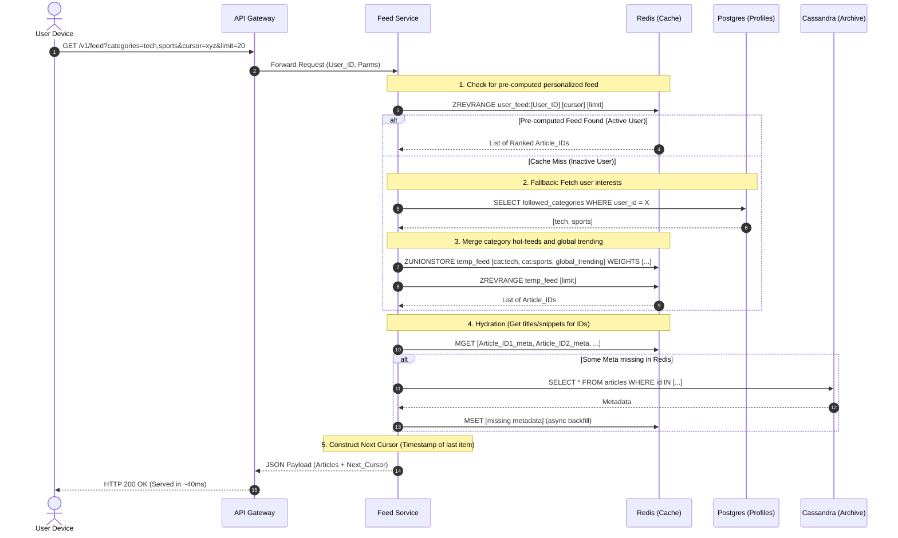

## API Specifications

**Base URL:** `https://api.googlenewsaggregator.com/v1`

### 1. Fetch Personalized News Feed
Provides an infinite scrolling list of news articles personalized to the user.

*   **Endpoint:** `GET /feed`
*   **Authentication:** Required (Bearer Token in Request Header)
*   **Query Parameters:**

| Parameter | Type | Required | Description |
| :--- | :--- | :--- | :--- |
| `cursor` | String | No | Encoded token for pagination. If omitted, returns page 1. Derived from the last item of previous response. |
| `limit` | Integer | No | Default: 20. Max: 50. Number of items per page. |
| `categories` | String | No | Comma-separated list (e.g., `tech,sports`). Overrides profile preferences for this request only. |
| `lang` | String | No | E.g., `en-US`. For localization. |

*   **Success Response (200 OK):**
    ```json
    {
      "status": "success",
      "data": {
        "articles": [
          {
            "article_id": "uuid-1234-5678",
            "title": "Nvidia Announces New AI Chip Architecture",
            "snippet": "The new Blackwell GPU promises massive performance leaps...",
            "publisher": {
              "name": "TechCrunch",
              "favicon_url": "[https://cdn.example.com/tc.png](https://cdn.example.com/tc.png)"
            },
            "category": "Technology",
            "published_at": "2024-05-20T14:30:00Z",
            "thumbnail_url": "[https://images.example.com/chip.jpg](https://images.example.com/chip.jpg)",
            "redirect_url": "[https://api.googlenewsaggregator.com/v1/r?aid=uuid-1234-5678](https://api.googlenewsaggregator.com/v1/r?aid=uuid-1234-5678)" 
          }
        ],
        "pagination": {
          "next_cursor": "Y29udGVudF9pZDoyMDI0LTA1LTIwVDExOjU5OjAwWg==",
          "has_more": true
        }
      }
    }
    ```

### 2. Article Interaction (Analytics Beacon & Redirect)
Clients call this API when a user clicks an article. The backend handles the redirect to the third party and asynchronously logs the interaction for personalization and trending algorithms.

*   **Endpoint:** `GET /r`
*   **Authentication:** Not strictly required (token is usually embedded or passed via session cookies).
*   **Query Parameters:**

| Parameter | Type | Required | Description |
| :--- | :--- | :--- | :--- |
| `aid` | String | Yes | The internal Article ID (UUID). |
| `uid` | String | Yes | The User ID (often obfuscated or signed). |
| `source` | String | No | E.g., `home_feed`, `search`, `related`. Helps tune ML tracking. |

*   **Behavior:** The server logs the event to the data pipeline and responds immediately with an **HTTP 302 Found**, redirecting the client to the actual publisher's URL.

### 3. Update User Preferences
Updates the categories or specific sources the user follows.

*   **Endpoint:** `PATCH /user/profile`
*   **Authentication:** Required
*   **Request Body:**
    ```json
    {
      "followed_categories": {
        "add": ["politics"],
        "remove": ["crypto"]
      },
      "blocked_sources": ["spamsite.com"]
    }
    ```
*   **Success Response (200 OK):**
    ```json
    {
      "status": "success",
      "message": "Profile updated. Feed will refresh shortly."
    }
# The Read Path: News Feed Retrieval Journey

The read path is the most latency-sensitive part of the entire system. Our non-functional requirement dictates a sub-100ms response time for infinite feed scrolling. To achieve this, the architecture relies heavily on pre-computation, aggressive caching, and dynamic resolution (late binding).

Below is the detailed journey of a `GET /v1/feed` request from the client to the database and back.

---

## 1. Edge & API Gateway Layer

Before the request reaches our core application servers, it passes through the edge.

1.  **CDN (Cloudflare / AWS CloudFront):** Static assets like publisher favicons and article thumbnails are cached and served directly from edge nodes closest to the user. The dynamic JSON request for the feed passes through to the load balancer.
2.  **API Gateway:** 
    *   **Authentication:** Validates the JWT token. If no token is present, the request is flagged as an *Anonymous User*.
    *   **Rate Limiting:** Prevents scraping and DDoS attacks using a Redis-backed Token Bucket algorithm.
    *   **Routing:** Forwards the validated request to the `Feed Generation Service`.

---

## 2. Feed Generation Service: The Core Logic

The `Feed Generation Service` (typically written in Go or Rust for high-throughput, low-latency I/O) orchestrates the retrieval. It branches its logic based on the user's state.

### Path A: Active Logged-in Users (The Fast Path)
An "Active User" is someone who has logged in recently, meaning the background *Fan-out Worker* has been actively keeping their personalized feed pre-computed in Redis.

1.  **Fetch Cluster IDs:** The service queries Redis: `ZREVRANGE user_feed:{user_id} {cursor} {limit}`.
2.  **Result:** Redis instantly returns a ranked list of `Cluster_IDs` (e.g., top 20 stories).
3.  **Dynamic Resolution:** The service cross-references the user's publisher affinities (cached in memory or Redis) against the available publishers for those `Cluster_IDs`, selecting the optimal `Article_ID` for each story (e.g., picking the NYT version over the AP News version).

### Path B: Inactive Users (The Cold Start / Fallback Path)
If a user hasn't opened the app in 7 days, their `user_feed:{user_id}` Redis key will have expired (TTL eviction) to save RAM. 

1.  **Cache Miss:** The `ZREVRANGE` command returns null/empty.
2.  **Fetch Profile:** The service falls back to PostgreSQL (or a fast read-replica) to fetch the user's `followed_categories` and `publisher_affinities`.
3.  **On-the-Fly Merge:** The service dynamically generates the feed by querying the hot category feeds in Redis:
    *   `ZUNIONSTORE temp_user_feed:{user_id} 2 category_feed:tech category_feed:finance WEIGHTS 1.5 1.0`
4.  **Cache Population:** The resulting merged ZSET is saved back to Redis as the user's new `user_feed:{user_id}` and assigned a fresh 7-day TTL.
5.  **Continuation:** The flow merges back into Path A, extracting the `Cluster_IDs` and resolving them to `Article_IDs`.

### Path C: Anonymous Users (The Unpersonalized Path)
If the user is not logged in or is a brand-new user without preferences.

1.  **Fetch Global Trending:** The service bypasses user-specific logic and directly queries the global hotlist: `ZREVRANGE global_trending {cursor} {limit}`.
2.  **Default Resolution:** Since there is no publisher affinity graph for anonymous users, the service simply uses the "Default Head Article" for each `Cluster_ID`.

---

## 3. The Hydration Phase (Metadata Fetching)

Once the Feed Service has a list of 20 finalized `Article_IDs`, it needs the actual text and URLs to send to the mobile app.

1.  **Redis MGET:** The service executes a single batched command: `MGET article_meta:{id_1} article_meta:{id_2} ... article_meta:{id_20}`.
2.  **The Happy Path (Cache Hit):** Redis returns the JSON strings containing titles, snippets, and thumbnail URLs. The service formats the final payload, generates the next pagination `cursor` (usually the timestamp of the 20th item), and returns the HTTP 200 response. Total time: ~40ms.

### Cache Miss during Hydration
If an article is older than 7 days, its metadata might have been evicted from Redis.
1.  **Database Fallback:** The service takes the missing IDs and queries the persistent Cassandra cluster: `SELECT * FROM Articles_By_Category WHERE article_id IN (...)`.
2.  **Async Read-Repair:** The service returns the data to the user immediately to keep latency low, but fires an asynchronous background task to write the missing metadata back into Redis (Read-Through/Read-Repair pattern) so the next user querying that article gets a cache hit.

---

## 4. Resiliency, Error Handling & Component Failures

A Senior Engineer must assume everything will fail. Here is how the Read Path maintains High Availability (HA) during severe outages.

### A. Redis Cluster Failure
**Scenario:** A network partition or massive OOM kills the primary Redis nodes holding the feed ZSETs.
*   **Resiliency Strategy:** 
    1.  **Replica Promotion:** Redis Sentinel/Cluster automatically promotes read-replicas to primary nodes.
    2.  **Graceful Degradation to Cassandra:** If the entire Redis cluster goes down, the Feed Service's circuit breakers flip. The system routes all feed requests directly to Cassandra. 
    3.  **User Impact:** We abandon personalization temporarily. We execute a basic chronological query against Cassandra's `Articles_By_Category` table. Latency spikes from 40ms to ~250ms, but the app remains up and the user still sees news.

### B. Cassandra Node Failure
**Scenario:** A disk fails on a Cassandra node holding the historical article metadata.
*   **Resiliency Strategy:** 
    1.  **Replication Factor:** Cassandra is configured with a Replication Factor of 3 (RF=3) and a Read Consistency Level of `QUORUM`. If one node dies, the other two nodes seamlessly return the data.
    2.  **Degraded Hydration:** If a specific article's metadata simply cannot be fetched from anywhere, the Feed Service drops that individual `Article_ID` from the response array rather than failing the entire API request. The user gets 19 articles instead of 20.

### C. ML Inference / Recommendation Engine Outage
**Scenario:** The GPU cluster generating personalized ML ranking scores goes offline.
*   **Resiliency Strategy:**
    1.  **Circuit Breaker (e.g., using Resilience4j):** The API Gateway stops sending events to the ML service.
    2.  **Fallback Heuristic:** The Feed Generation service defaults to a strict chronological sort (`published_at` timestamp) based purely on the user's followed categories. The feed becomes slightly less "smart", but remains perfectly functional.

### D. Traffic Spikes (Thundering Herd / Breaking News)
**Scenario:** A massive global event occurs (e.g., the Super Bowl, a major election), causing a 100x spike in anonymous and active user traffic.
*   **Resiliency Strategy:**
    1.  **Load Shedding:** The API Gateway monitors backend CPU/Memory. If thresholds exceed 85%, it actively starts dropping requests from *Anonymous Users* (HTTP 429 Too Many Requests) to preserve bandwidth and compute for *Authenticated Active Users*.
    2.  **Stale Cache Serving:** If backend databases slow down, the API Gateway can be instructed to serve slightly stale pre-computed feeds from a secondary edge cache (CDN) for an extra 60 seconds, drastically absorbing the read spike.
