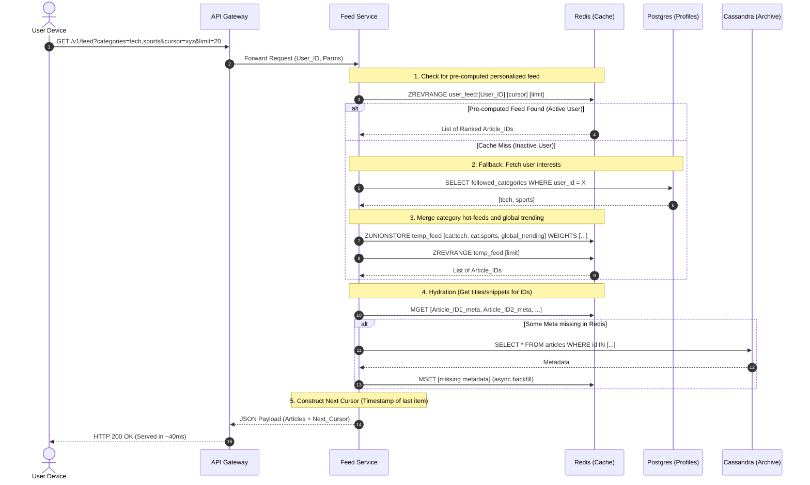

```mermaid
sequenceDiagram
    autonumber
    actor User as User Device
    participant G as API Gateway
    participant F as Feed Service
    participant R as Redis (Cache)
    participant P as Postgres (Profiles)
    participant C as Cassandra (Archive)

    User->>G: GET /v1/feed?categories=tech,sports&cursor=xyz&limit=20
    G->>F: Forward Request (User_ID, Parms)
    
    Note over F,R: 1. Check for pre-computed personalized feed
    F->>R: ZREVRANGE user_feed:[User_ID] [cursor] [limit]
    
    alt Pre-computed Feed Found (Active User)
        R-->>F: List of Ranked Article_IDs
    else Cache Miss (Inactive User)
        Note over F,P: 2. Fallback: Fetch user interests
        F->>P: SELECT followed_categories WHERE user_id = X
        P-->>F: [tech, sports]
        
        Note over F,R: 3. Merge category hot-feeds and global trending
        F->>R: ZUNIONSTORE temp_feed [cat:tech, cat:sports, global_trending] WEIGHTS [...]
        F->>R: ZREVRANGE temp_feed [limit]
        R-->>F: List of Article_IDs
    end

    Note over F,R: 4. Hydration (Get titles/snippets for IDs)
    F->>R: MGET [Article_ID1_meta, Article_ID2_meta, ...]
    
    alt Some Meta missing in Redis
        F->>C: SELECT * FROM articles WHERE id IN [...]
        C-->>F: Metadata
        F->>R: MSET [missing metadata] (async backfill)
    end

    Note over F: 5. Construct Next Cursor (Timestamp of last item)
    F-->>G: JSON Payload (Articles + Next_Cursor)
    G-->>User: HTTP 200 OK (Served in ~40ms)
```
