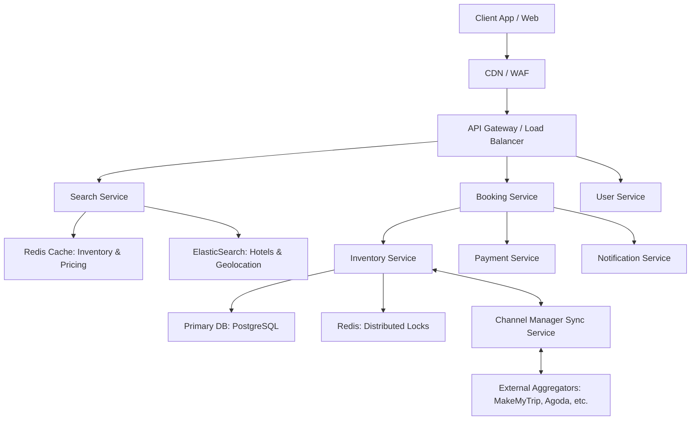

# Hotel Reservation System and Aggregator Design

## 1. System Requirements

### 1.1. Functional Requirements
* **Search & Discovery:** Users can search for hotels by location (e.g., city, neighborhood, or landmark), check-in/check-out dates, and number of rooms/guests.
* **Details & Pricing:** Users can view hotel metadata (amenities, photos, reviews) and real-time room availability with pricing.
* **Reservation Management:** 
  * Users can book one or multiple rooms across different room types in a single transaction.
  * Users can modify existing reservations (change dates, room types, or quantity), subject to availability and dynamic fare differences.
  * Users can cancel reservations and trigger automated refund workflows based on the hotel's cancellation policy.
* **Inventory Synchronization:** The system must push and pull inventory updates in real-time to/from external aggregators via a Channel Manager to prevent double-booking.
* **Hotel Admin Portal:** Hotel owners must be able to onboard their properties, manage room inventory, and manually adjust pricing.

### 1.2. Non-Functional Requirements
* **Consistency over Availability (for Bookings):** The booking and inventory deduction processes must be strictly consistent (ACID compliant) to guarantee zero double-bookings, even at the cost of slightly higher latency during the checkout phase.
* **High Availability (for Search):** The search infrastructure must be highly available (99.99% uptime) and horizontally scalable to handle severe traffic spikes during peak holiday seasons and long weekends.
* **Latency Tolerances:**
  * Search queries should return results in `< 200ms`.
  * Booking mutations (reserving a room) should complete in `< 2 seconds` (excluding external payment gateway processing time).
* **Idempotency:** All state-mutating APIs (Create, Modify, Cancel, Payment Webhooks) must be strictly idempotent to safely handle network retries.
* **Fault Tolerance:** The system must gracefully degrade. If the external Channel Manager goes down, our internal booking engine should still function for direct user traffic.

### 1.3. Out of Scope
* **Dynamic Pricing Engine:** Building the machine learning algorithms for demand-based dynamic pricing is out of scope. We assume pricing is either set manually by hotel admins or ingested from an external pricing oracle.
* **Multi-Vertical Travel Booking:** The system strictly handles hotel accommodations.
* **Payment Gateway Internal Implementation:** We will integrate with third-party payment processors (e.g., Razorpay, Stripe) rather than building a custom payment processing and PCI-DSS compliant vaulting system.
* **Recommendation Engine:** Personalized user search rankings and collaborative filtering recommendations are excluded for the V1 architecture.
* **Customer Support/Ticketing:** In-app chat, support ticketing, and dispute resolution systems are not part of this core architecture.

## 2. High-Level System Architecture

The architecture follows a microservices approach to ensure scalability, fault isolation, and independent deployments. Since the system acts as both a booking engine and an aggregator, it must handle high-read volumes (searching for hotels) and strictly consistent write volumes (booking rooms).

### Architecture Diagram


## 3. Core Components Deep Dive

This section provides a granular look at the internal responsibilities, design patterns, and technologies used within each core microservice of the Hotel Reservation System.

### 3.1. API Gateway
Acting as the single entry point for all client applications (Web, iOS, Android), the API Gateway protects the internal network and handles cross-cutting concerns.

*   **Technology Choice:** Kong, Apache APISIX, or AWS API Gateway.
*   **Key Responsibilities:**
    *   **Authentication & Authorization:** Validates JWTs (JSON Web Tokens) before routing traffic to backend services. Unauthenticated users are routed only to the Search Service.
    *   **Rate Limiting:** Implements Token Bucket algorithms (e.g., 100 requests/minute per IP) to prevent scraping bots from draining our Search Service and API abuse.
    *   **Circuit Breaking:** Uses patterns (e.g., Resilience4j) to short-circuit requests if a backend service (like the Channel Manager) is struggling, preventing cascading system failures.
    *   **WAF (Web Application Firewall):** Filters out malicious payloads (SQLi, XSS) before they hit internal services.

### 3.2. Search Service (Read-Heavy)
The Search Service handles extreme read loads, especially during holiday spikes. It decouples the read operations from the transactional database using the CQRS (Command Query Responsibility Segregation) pattern.

*   **Technology Choice:** Golang or Node.js (for high concurrency), ElasticSearch, Redis cluster.
*   **Key Responsibilities:**
    *   **Geospatial Queries:** ElasticSearch is used to handle location-based searches. Hotels are indexed with geo-coordinates. If a user searches for "Hotels near MG Road", ElasticSearch uses `geo_distance` queries to rank results within a 5km radius.
    *   **Faceted Filtering:** Handles dynamic filters like "Free Breakfast", "Pool", or "Price < ₹5000" using ElasticSearch aggregations.
    *   **Availability Aggregation:** While ElasticSearch holds the static metadata (names, pictures, amenities), the actual real-time room availability is fetched from Redis. The Search Service merges ElasticSearch results with Redis availability counts before returning the payload.

### 3.3. Booking Service (The Orchestrator)
This is a stateful orchestrator that manages the complex lifecycle of a reservation. It relies heavily on asynchronous event-driven architecture to coordinate multiple services without blocking.

*   **Technology Choice:** Java/Spring Boot or Go, Kafka/RabbitMQ for event streaming.
*   **Key Responsibilities:**
    *   **Saga Pattern (Choreography/Orchestration):** Managing a booking requires updates to Inventory, interacting with Payments, and sending Notifications. The Booking Service acts as the orchestrator to execute these distributed transactions and handle rollbacks (compensating transactions) if a step fails.
    *   **Idempotency Handling:** Uses Redis to cache `Idempotency-Key` headers sent by the client. If a user's network drops and they retry the exact same booking request, the service recognizes the key and returns the existing reservation state instead of double-booking.
    *   **Payment Gateway Integration:** Interfaces with external payment processors (e.g., Razorpay, Juspay). It generates secure payment links and listens for asynchronous payment success webhooks to transition a reservation from `PENDING_PAYMENT` to `CONFIRMED`.

### 3.4. Inventory Service (Write-Heavy / Source of Truth)
This service is the heart of the system. It guarantees data consistency and prevents the catastrophic scenario of double-booking a single room.

*   **Technology Choice:** Java/Spring Boot, PostgreSQL (ACID compliant), Redis (for distributed locks).
*   **Key Responsibilities:**
    *   **Row-Level Locking:** Uses pessimistic locking at the database level. When a booking is initiated, it executes `SELECT * FROM Room_Inventory WHERE hotel_id = X AND date = Y FOR UPDATE`. This locks the row, ensuring no other concurrent transaction can modify that specific inventory until the current transaction commits or rolls back.
    *   **Temporary Holds:** When a user proceeds to checkout, they are given a time window (e.g., 10 minutes) to complete the payment. The Inventory Service places a TTL-based lock in Redis. If the TTL expires without a payment webhook confirming the order, the hold is released, and the room becomes available in the Search Service again.
    *   **Constraint Enforcement:** Relies on strict PostgreSQL constraints (`CHECK (available_rooms >= 0)`) as the final defense against race conditions.

### 3.5. Channel Manager Sync Service
Because our system acts as both a direct booking engine and an aggregator, we share inventory with external Online Travel Agencies (OTAs) like MakeMyTrip, Agoda, and Booking.com. The Channel Manager prevents conflicts between our system and external aggregators.

*   **Technology Choice:** Python or Node.js (excellent for handling diverse third-party APIs), Kafka, Redis (for deduplication).
*   **Key Responsibilities:**
    *   **Inbound Webhook Processor (Pull/Receive):** Exposes secure endpoints for external OTAs to push their booking events. When an external booking occurs, this service translates the OTA's specific payload into our standard internal format and asks the Inventory Service to deduct a room.
    *   **Outbound Event Consumer (Push):** Listens to a Kafka topic for `InventoryUpdated` events. Whenever a room is booked directly on our platform, the Channel Manager consumes this event and makes parallel API calls to all connected external OTAs to reduce the inventory on their end.
    *   **Dead Letter Queues (DLQ) & Retry Logic:** External aggregator APIs can be unreliable. If an outbound sync fails, the message is routed to a retry queue with exponential backoff. If it fails repeatedly, it lands in a DLQ for manual intervention or automated reconciliation scripts to fix the sync drift later.
 
## 4. Persistence Layer Design

To achieve high availability for reads and strict consistency for writes, the system employs a polyglot persistence strategy utilizing PostgreSQL, Redis, and ElasticSearch.

### 1. Relational Database (PostgreSQL)

PostgreSQL acts as the absolute source of truth for transactional data. It ensures ACID compliance, which is critical for the `room_inventory` and `reservations` tables to prevent double-booking.

#### 1.1 Tables and Schema

**Table: `hotels`**
Stores core metadata about the properties.
*   `id` (UUID, Primary Key)
*   `name` (VARCHAR 255, Not Null)
*   `description` (TEXT)
*   `address_line` (VARCHAR 255)
*   `city` (VARCHAR 100) - *e.g., "Bengaluru"*
*   `state` (VARCHAR 100) - *e.g., "Karnataka"*
*   `country` (VARCHAR 100)
*   `latitude` (DECIMAL 10,8)
*   `longitude` (DECIMAL 11,8)
*   `status` (ENUM: 'ACTIVE', 'INACTIVE', 'SUSPENDED')
*   `created_at` (TIMESTAMP, Default CURRENT_TIMESTAMP)
*   `updated_at` (TIMESTAMP)

**Table: `room_types`**
Defines the categories of rooms available in a specific hotel.
*   `id` (UUID, Primary Key)
*   `hotel_id` (UUID, Foreign Key -> `hotels.id`)
*   `name` (VARCHAR 100) - *e.g., "Deluxe King", "Standard Twin"*
*   `max_occupancy` (INT, Not Null)
*   `base_price` (DECIMAL 10,2)

**Table: `room_inventory`**
The most critical table for concurrency. It maintains the daily availability count per room type.
*   `id` (UUID, Primary Key)
*   `hotel_id` (UUID, Foreign Key -> `hotels.id`)
*   `room_type_id` (UUID, Foreign Key -> `room_types.id`)
*   `date` (DATE, Not Null)
*   `total_allocated_rooms` (INT, Not Null)
*   `available_rooms` (INT, Not Null) - *Constraint: `CHECK (available_rooms >= 0)`*
*   `dynamic_price` (DECIMAL 10,2)
*   **Indexes:**
    *   `UNIQUE INDEX idx_inventory_unique (hotel_id, room_type_id, date)`
    *   `INDEX idx_hotel_date (hotel_id, date)`

**Table: `reservations`**
Records the booking transaction details.
*   `id` (UUID, Primary Key)
*   `user_id` (UUID, Not Null)
*   `hotel_id` (UUID, Foreign Key -> `hotels.id`)
*   `check_in_date` (DATE, Not Null)
*   `check_out_date` (DATE, Not Null)
*   `status` (ENUM: 'PENDING_PAYMENT', 'CONFIRMED', 'CANCELLED', 'REFUNDED')
*   `total_amount` (DECIMAL 10,2)
*   `currency` (VARCHAR 3) - *e.g., "INR"*
*   `created_at` (TIMESTAMP)
*   **Indexes:**
    *   `INDEX idx_user_reservations (user_id)`

**Table: `reservation_rooms`**
Maps multiple rooms/room types to a single reservation.
*   `id` (UUID, Primary Key)
*   `reservation_id` (UUID, Foreign Key -> `reservations.id`)
*   `room_type_id` (UUID, Foreign Key -> `room_types.id`)
*   `quantity` (INT, Not Null)
*   `price_locked` (DECIMAL 10,2)

---

### 2. In-Memory Data Store (Redis)

Redis is used for caching, distributed locking, and managing idempotency to handle high throughput and transient states.

#### 2.1 Key Structures

**1. Real-Time Inventory Cache**
To avoid querying PostgreSQL for every search request.
*   **Key:** `inventory:{hotel_id}:{date}`
*   **Data Type:** Hash
*   **Structure:**
    *   Field: `{room_type_id}`
    *   Value: `{"available": 4, "price": 4500.00}`
*   **TTL:** Set to expire after the date has passed.

**2. Distributed Locks (Pessimistic Locking)**
Used when a user initiates the checkout process to temporarily hold inventory.
*   **Key:** `lock:inventory:{room_type_id}:{date}`
*   **Data Type:** String
*   **Value:** `{user_id}`
*   **TTL:** 10 Minutes (600 seconds). If payment is not completed, the key expires and inventory is freed.

**3. Idempotency Keys**
Prevents duplicate bookings if a network request is retried.
*   **Key:** `idempotency:booking:{uuid}`
*   **Data Type:** String
*   **Value:** `{ "status": "CONFIRMED", "reservation_id": "..." }`
*   **TTL:** 24 Hours.

---

### 3. Search Engine (ElasticSearch)

ElasticSearch powers the read-heavy discovery phase, handling complex text searches, faceted filtering, and geospatial queries.

#### 3.1 Document Mapping: `hotels_index`

```json
{
  "mappings": {
    "properties": {
      "hotel_id": { "type": "keyword" },
      "name": { 
        "type": "text",
        "analyzer": "standard"
      },
      "description": { "type": "text" },
      "location": { 
        "type": "geo_point" 
      },
      "city": { "type": "keyword" },
      "amenities": { "type": "keyword" },
      "star_rating": { "type": "float" },
      "review_score": { "type": "float" },
      "room_types": {
        "type": "nested",
        "properties": {
          "room_type_id": { "type": "keyword" },
          "name": { "type": "keyword" },
          "base_price": { "type": "double" }
        }
      }
    }
  }
}
```
#### 3.2 Sync Strategy
** Static Data (Name, Amenities, Location):** Synced from PostgreSQL to ElasticSearch via CDC (Change Data Capture) tools like Debezium, triggered whenever hotel metadata is updated.

** Dynamic Data (Availability):** Not stored in ElasticSearch. The Search Service queries ElasticSearch for matching properties, then performs a real-time cross-check against Redis to filter out sold-out hotels before returning the final payload to the user.

## 5. API Specifications (REST)

The system exposes RESTful APIs for clients (Web/Mobile) and webhooks for external integrations. All endpoints assume a base URL of `https://api.domain.com` and require standard JWT-based authorization (except for public search).

### 5.1. Search Hotels (Public)
Fetches available hotels based on location, dates, and occupancy. Merges static data from ElasticSearch with real-time availability from Redis.

**Endpoint:** `GET /api/v1/hotels/search`

**Query Parameters:**
*   `location` (String, Required): e.g., "Koramangala", "Bengaluru", "MG Road"
*   `check_in` (Date YYYY-MM-DD, Required): e.g., "2026-05-10"
*   `check_out` (Date YYYY-MM-DD, Required): e.g., "2026-05-12"
*   `rooms` (Integer, Required): Number of rooms needed.
*   `guests` (Integer, Optional): Total number of guests.
*   `page` (Integer, Optional): Default `1`.

**Response:** `200 OK`
```json
{
  "metadata": {
    "total_results": 124,
    "page": 1
  },
  "data": [
    {
      "hotel_id": "h-9876-abcd",
      "name": "Grand Stay Bengaluru",
      "location": {
        "address": "100 Feet Road, Indiranagar",
        "coordinates": [77.6411, 12.9715]
      },
      "amenities": ["Free WiFi", "Breakfast Included", "Pool"],
      "available_room_types": [
        {
          "room_type_id": "rt-1234-xyz",
          "name": "Deluxe Double Room",
          "price_per_night": 4500.00,
          "currency": "INR",
          "available_count": 3
        }
      ]
    }
  ]
}
```
### 5.2. Create Reservation (Protected)
Initiates a new booking. Holds the inventory temporarily using Redis distributed locks while awaiting payment confirmation.

**Endpoint:** `POST /api/v1/reservations`

**Headers:** `Authorization: Bearer <JWT_TOKEN>`

**Idempotency-Key:** uuid (Crucial for safely retrying network timeouts)

**Request Payload:

```json
{
  "hotel_id": "h-9876-abcd",
  "check_in": "2026-05-10",
  "check_out": "2026-05-12",
  "rooms": [
    {
      "room_type_id": "rt-1234-xyz",
      "quantity": 1
    }
  ],
  "primary_guest": {
    "name": "Rahul Sharma",
    "email": "rahul.s@example.com",
    "phone": "+919876543210"
  }
}
```
**Response:** `201 Created`

```json
{
  "reservation_id": "res-5555-qwerty",
  "status": "PENDING_PAYMENT",
  "total_amount": 9000.00,
  "currency": "INR",
  "expires_at": "2026-04-28T23:00:00+05:30",
  "payment_gateway_url": "[https://checkout.razorpay.com/pay/xyz123](https://checkout.razorpay.com/pay/xyz123)"
}
```
### 5.3. Modify Reservation (Protected)
Allows users to change dates or add/remove rooms. Involves complex fare recalculation and inventory availability checks.

**Endpoint:** `PATCH /api/v1/reservations/{reservation_id}`

**Request Payload:

```json
{
  "new_check_out": "2026-05-13",
  "rooms": [
    {
      "room_type_id": "rt-1234-xyz",
      "quantity": 2 
    }
  ]
}
```
**Response:** `200 OK`

```json
{
  "reservation_id": "res-5555-qwerty",
  "status": "MODIFICATION_PENDING_PAYMENT",
  "fare_difference": 9000.00,
  "currency": "INR",
  "payment_gateway_url": "[https://checkout.razorpay.com/pay/abc987](https://checkout.razorpay.com/pay/abc987)"
}
```
### 5.4. Cancel Reservation (Protected)
Cancels a booking, frees up PostgreSQL inventory, invalidates Redis cache, and triggers async refunds.

**Endpoint:** `DELETE /api/v1/reservations/{reservation_id}`

**Response:** `200 OK`

```json
{
  "reservation_id": "res-5555-qwerty",
  "status": "CANCELLED",
  "refund_details": {
    "refund_amount": 9000.00,
    "currency": "INR",
    "status": "INITIATED",
    "estimated_days": "5-7 business days"
  }
}
```
### 5.5. Channel Manager Webhook (Internal/B2B)
Endpoint for external Online Travel Agencies (like MakeMyTrip, Agoda) to notify our system when they sell one of our rooms, ensuring our central DB stays updated.

**Endpoint:** `POST /api/v1/webhooks/channel-manager/inventory`

**Headers:**

`X-Signature: HMAC SHA256 signature for payload verification.`

**Request Payload:**

```json
{
  "source": "MakeMyTrip",
  "external_booking_id": "MMT-999888",
  "hotel_id": "h-9876-abcd",
  "room_type_id": "rt-1234-xyz",
  "check_in": "2026-05-10",
  "check_out": "2026-05-12",
  "rooms_booked": 1
}
```
**Response: `202 Accepted`
(The system accepts the payload and processes the inventory deduction asynchronously).

## 6. Caching & Concurrency Handling (Deep Dive)

Handling highly concurrent read/write operations is the most complex engineering challenge in a Hotel Aggregator. During peak travel seasons (e.g., long holiday weekends), a single popular property might receive thousands of concurrent search queries and dozens of simultaneous booking attempts for the last remaining room. 

This section details how the system achieves **High Availability (Eventual Consistency) for Reads** and **Strict Consistency (ACID) for Writes**.

### 6.1. Concurrency Control: Preventing Double-Bookings

The system employs a multi-layered defense mechanism to absolutely guarantee that a room is never double-booked, even when external aggregators and direct users compete for the same inventory.

#### Layer 1: Distributed Locking (The "Hold" Phase)
When a user selects a room and proceeds to the checkout/payment page, the system must temporarily reserve that room so it isn't sold to someone else while the user is entering their credit card details.

*   **Mechanism:** Redis Distributed Locks.
*   **Execution:** The Booking Service attempts to set a lock with a Time-To-Live (TTL).
    ```redis
    // Attempt to acquire a lock for a specific room type on a specific date
    SET lock:inventory:{hotel_id}:{room_type_id}:{date}:{user_id} "locked" EX 600 NX
    ```
*   **Outcome:** 
    *   `EX 600` ensures the lock automatically drops after 10 minutes (600 seconds) if the payment fails or the user abandons the session.
    *   If successful, the Search Cache is temporarily decremented so the room appears "Sold Out" to other searching users.

#### Layer 2: Pessimistic Database Locking (The "Commit" Phase)
Once the Payment Service confirms a successful transaction via webhook, the Booking Service must permanently deduct the inventory in the PostgreSQL database.

*   **Mechanism:** Row-level locking via `SELECT ... FOR UPDATE`.
*   **Execution:** 
    ```sql
    BEGIN;
    -- Locks the specific row. Other concurrent transactions must wait.
    SELECT available_rooms FROM room_inventory 
    WHERE hotel_id = 'h-123' AND room_type_id = 'rt-456' AND date = '2026-05-10' 
    FOR UPDATE;
    
    -- Application checks if available_rooms >= requested_rooms
    
    UPDATE room_inventory 
    SET available_rooms = available_rooms - 1 
    WHERE hotel_id = 'h-123' AND room_type_id = 'rt-456' AND date = '2026-05-10';
    COMMIT;
    ```
*   **Why not Optimistic Locking?** Optimistic locking (using a `version` column) causes high transaction failure rates during peak contention, forcing the application to retry heavily. Pessimistic locking gracefully queues the operations at the database level, which is safer for high-contention financial transactions.

#### Layer 3: Database Constraints (The Failsafe)
As a final safety net against application-level bugs, the PostgreSQL schema enforces a strict constraint.
*   **Mechanism:** `CHECK (available_rooms >= 0)`.
*   If a race condition somehow bypasses the application locks, the database will violently reject the transaction rather than allowing negative inventory.

---

### 6.2. Caching Strategy: Handling Massive Read Volumes

Search traffic typically outpaces booking traffic by a ratio of 1000:1. Querying PostgreSQL for every search would instantly overwhelm the database. 

#### The Search Architecture (Read Path)
1.  **ElasticSearch** filters hotels based on location, amenities, and static metadata.
2.  **Redis** holds the real-time availability and dynamic pricing.
3.  The **Search Service** intersects the two in memory.

#### Redis Data Structures
We use Redis Hashes to store daily inventory for lightning-fast `O(1)` lookups.

*   **Key Pattern:** `inv:{hotel_id}:{date}`
*   **Structure:**
    ```json
    // HGETALL inv:h-9876-abcd:2026-05-10
    {
      "rt-1234-xyz": "3", // Deluxe Room: 3 available
      "rt-5678-abc": "0"  // Standard Room: Sold out
    }
    ```

#### Cache Invalidation Strategy (Write-Through)
To keep the search results as accurate as possible, the cache is updated synchronously during the booking workflow.

1.  **On Payment Success:** The Booking Service updates PostgreSQL.
2.  Within the same application workflow, it issues a Redis command: `HINCRBY inv:h-9876-abcd:2026-05-10 rt-1234-xyz -1`.
3.  **Handling Drift:** Since Redis and Postgres are separate systems, network partitions can cause them to drift. A background Cron Job / Kubernetes CronJob runs every 5 minutes, querying PostgreSQL for all changes in the last 5 minutes and forcefully overwriting the Redis Hash to self-heal any discrepancies.

#### Stale Reads vs. Strict Writes
*   **Search is Eventually Consistent:** A user might see "1 Room Left" on the search page, but upon clicking "Book", they are told it is sold out. This is acceptable in the travel industry (and encourages urgency).
*   **Booking is Strictly Consistent:** A user will *never* be successfully charged for a room that does not exist.

---

### 6.3. API Idempotency: Handling Network Failures

Mobile networks can be spotty. If a user's app sends a `POST /reservations` request, the server processes it, but the response drops due to a network tunnel, the app might automatically retry the request. Without idempotency, the user would be charged twice and book two rooms.

1.  **The Key:** The client generates a unique UUID (e.g., `Idempotency-Key: req-888-abc`) and attaches it to the header of any state-mutating request.
2.  **The Cache:** Before processing, the API Gateway/Booking Service checks Redis for this key.
    *   If `NOT EXISTS`: Process the booking. Once done, store the exact HTTP response body and status code in Redis against this key with a 24-hour TTL.
    *   If `EXISTS`: Do not touch the database. Immediately return the cached HTTP response.
3.  **Result:** Safe retries. The user gets their confirmation screen without triggering a duplicate database transaction.

---

### 6.4. Handling B2B Concurrency (Channel Manager)

When a room is booked on an external aggregator (e.g., Agoda), they fire a webhook to our Channel Manager. 

1.  **Queueing:** The webhook is immediately placed onto a highly available Kafka topic (`external-bookings-topic`) and returns `202 Accepted` to the OTA to prevent timeout.
2.  **Processing:** Dedicated consumer workers read from Kafka and attempt the standard **Layer 2 (Pessimistic DB Lock)** workflow.
3.  **Conflict Resolution:** If our system booked the exact same room a millisecond earlier and `available_rooms` is now `0`, the PostgreSQL transaction fails. The worker catches this exception and triggers an automated "Rejection/Refund Webhook" back to the external OTA, informing them the booking failed on our end due to out-of-sync inventory.

---

## 7. Sequence Diagrams / CUJ

### **Search and Booking Journey**
```
sequenceDiagram
    participant User
    participant Gateway as API Gateway
    participant Search as Search Service
    participant Booking as Booking Service
    participant InvDB as Inventory DB (Postgres)
    participant Channel as Channel Manager

    User->>Gateway: GET /search?location=blr&dates...
    Gateway->>Search: Fetch available hotels
    Search-->>User: Return List & Prices
    
    User->>Gateway: POST /reservations
    Gateway->>Booking: Init Reservation (Idempotency Key)
    
    Booking->>InvDB: BEGIN Transaction
    Booking->>InvDB: SELECT available_rooms FOR UPDATE
    alt Rooms Available
        Booking->>InvDB: UPDATE available_rooms = available_rooms - 1
        Booking->>InvDB: COMMIT
        Booking-->>User: Return Reservation (Status: PENDING_PAYMENT)
        
        User->>Gateway: Complete Payment
        Gateway->>Booking: Webhook: Payment Success
        Booking->>InvDB: Update Reservation (Status: CONFIRMED)
        Booking-->>User: Booking Confirmed!
        
        Booking->>Channel: Async: Push inventory update
        Channel->>External OTAs: Sync Availability
    else Sold Out
        Booking->>InvDB: ROLLBACK
        Booking-->>User: Error: Rooms no longer available
    end
```

### **Cancellation Journey**
```
sequenceDiagram
    participant User
    participant Gateway as API Gateway
    participant Booking as Booking Service
    participant InvDB as Inventory DB
    participant Channel as Channel Manager

    User->>Gateway: DELETE /reservations/{id}
    Gateway->>Booking: Process Cancellation
    
    Booking->>InvDB: BEGIN Transaction
    Booking->>InvDB: Update Reservation (Status: CANCELLED)
    Booking->>InvDB: UPDATE available_rooms = available_rooms + 1
    Booking->>InvDB: COMMIT
    
    Booking-->>User: Cancellation Success (Refund Initiated)
    
    Booking->>Channel: Async: Push inventory update (+1)
    Channel->>External OTAs: Sync Availability
```
---

## 8. 

## 9. Architecture Trade-offs & Decisions

Here are the deliberate trade-offs made in this architecture:

### 9.1. Pessimistic vs. Optimistic Locking
*   **Decision:** Chose **Pessimistic Locking** (`SELECT ... FOR UPDATE`) in PostgreSQL for the checkout phase.
*   **Justification:** During peak travel times (e.g., long weekends, festive seasons), a single popular resort might have 50 users competing for the last 2 rooms. Optimistic locking (using version numbers) would cause 48 of those transactions to fail with a `StaleObjectStateException` right at the payment step, leading to a terrible user experience and complex application-level retry logic. Pessimistic locking handles this contention gracefully by queuing requests at the database level.
*   **Trade-off:** slightly higher latency and potential for database connection pool exhaustion if locks are held too long. We mitigate this by keeping the lock duration extremely short (only during the actual decrement operation, not the entire 10-minute payment window, which is handled by Redis).

### 9.2. Eventual Consistency (Search) vs. Strict Consistency (Booking)
*   **Decision:** The Search Service operates on eventually consistent data (Redis + ElasticSearch), while the Booking Service is strictly consistent (PostgreSQL).
*   **Justification:** The read-to-write ratio in travel aggregators is massive (often > 1000:1). Forcing every search query to hit the source-of-truth database would require an unfeasibly large and expensive database cluster.
*   **Trade-off:** A user might occasionally see "1 Room Available" on the search results page, but get a "Sold Out" error upon clicking "Book". This is a widely accepted industry standard; avoiding double-billing (Strict Consistency for Writes) is vastly more important than perfect search accuracy (Eventual Consistency for Reads).

### 9.3. Choreography vs. Orchestration (Saga Pattern)
*   **Decision:** Used an **Orchestration** approach for the Booking Saga, managed by the Booking Service.
*   **Justification:** Creating a reservation spans inventory holds, payment processing, and channel manager syncing. If we used Choreography (services reacting to each other's events directly), understanding the state of a complex booking requires tracing events across multiple systems. Centralizing the state machine in the Booking Service makes rollbacks (e.g., refunding if inventory sync fails) deterministic and easier to debug.

---

## 10. Observability & Monitoring

To guarantee 99.99% uptime, the system requires deep visibility into its distributed components. 

### 10.1. Distributed Tracing
*   **Tooling:** OpenTelemetry and Jaeger.
*   **Implementation:** Every request entering the API Gateway is assigned a unique `X-Trace-Id`. This ID is injected into HTTP headers and Kafka message payloads, allowing us to visualize the exact path of a request across the Gateway, Search, Inventory, and Payment services. This is critical for identifying latency bottlenecks.

### 10.2. Metrics & Dashboards
*   **Tooling:** Prometheus and Grafana.
*   **Key Service Level Indicators (SLIs):**
    *   **Search Latency:** P95 and P99 response times for the `/search` endpoint (Target: < 200ms).
    *   **Booking Success Rate:** Ratio of initiated bookings to confirmed bookings. A sudden drop indicates a payment gateway issue or widespread inventory sync failure.
    *   **Redis Cache Hit Ratio:** Ensures our search cache is effectively shielding PostgreSQL.
    *   **PostgreSQL Connection Pool Status:** Alerts on saturated DB connections, which often indicate locked rows taking too long to release.
    *   **Channel Manager Sync Lag:** Time taken to process external aggregator webhooks.

### 10.3. Centralized Logging
*   **Tooling:** ELK Stack (Elasticsearch, Logstash, Kibana) or Datadog.
*   **Implementation:** All microservices output structured JSON logs. We strictly mask PII (Personally Identifiable Information) and PCI data (credit card details) at the application layer before logs are shipped to the central cluster.

---

## 11. Follow-ups & Future Enhancements

As the platform scales and business requirements evolve, the V2 architecture should address the following areas:

### 11.1. Dynamic Pricing Engine
Currently, prices are assumed to be static or manually updated. A machine learning-based pricing engine would consume historical booking data, local event schedules, and competitor pricing to adjust the `dynamic_price` column in real-time, maximizing revenue yield per room.

### 11.2. Multi-Region Active-Active Deployment
To survive a complete AWS/GCP region outage, the system would need to span multiple geographic regions. This requires moving from standard PostgreSQL to a globally distributed database (like CockroachDB or Amazon Aurora Global) to handle write conflicts across regions safely.

### 11.3. GraphQL for Client APIs
Mobile clients often suffer from "over-fetching" (downloading unnecessary data) with REST APIs. Introducing a GraphQL Federation layer at the API Gateway would allow mobile apps to request exactly what they need (e.g., just the price and image, without the full list of amenities), reducing payload size and improving perceived load times on slower cellular networks.

### 11.4. Fraud Detection System
Implementing behavioral analysis on the booking flow to detect card-testing bots or bulk inventory hoarding by malicious actors. This would sit as an async consumer off the API Gateway's traffic stream.
