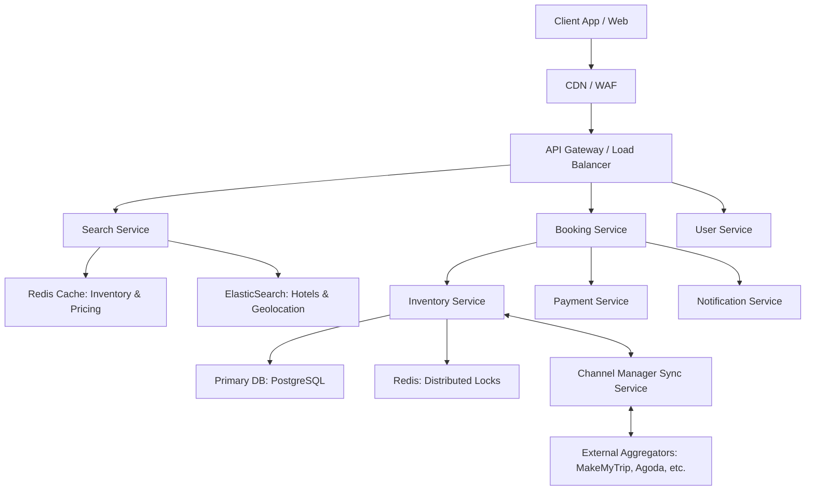

# Hotel Reservation System and Aggregator Design

## 1. System Requirements

### 1.1. Functional Requirements
* **Search & Discovery:** Users can search for hotels by location (e.g., city, neighborhood, or landmark), check-in/check-out dates, and number of rooms/guests.
* **Details & Pricing:** Users can view hotel metadata (amenities, photos, reviews) and real-time room availability with pricing.
* **Reservation Management:** 
  * Users can book one or multiple rooms across different room types in a single transaction.
  * Users can modify existing reservations (change dates, room types, or quantity), subject to availability and dynamic fare differences.
  * Users can cancel reservations and trigger automated refund workflows based on the hotel's cancellation policy.
* **Inventory Synchronization:** The system must push and pull inventory updates in real-time to/from external aggregators via a Channel Manager to prevent double-booking.
* **Hotel Admin Portal:** Hotel owners must be able to onboard their properties, manage room inventory, and manually adjust pricing.

### 1.2. Non-Functional Requirements
* **Consistency over Availability (for Bookings):** The booking and inventory deduction processes must be strictly consistent (ACID compliant) to guarantee zero double-bookings, even at the cost of slightly higher latency during the checkout phase.
* **High Availability (for Search):** The search infrastructure must be highly available (99.99% uptime) and horizontally scalable to handle severe traffic spikes during peak holiday seasons and long weekends.
* **Latency Tolerances:**
  * Search queries should return results in `< 200ms`.
  * Booking mutations (reserving a room) should complete in `< 2 seconds` (excluding external payment gateway processing time).
* **Idempotency:** All state-mutating APIs (Create, Modify, Cancel, Payment Webhooks) must be strictly idempotent to safely handle network retries.
* **Fault Tolerance:** The system must gracefully degrade. If the external Channel Manager goes down, our internal booking engine should still function for direct user traffic.

### 1.3. Out of Scope
* **Dynamic Pricing Engine:** Building the machine learning algorithms for demand-based dynamic pricing is out of scope. We assume pricing is either set manually by hotel admins or ingested from an external pricing oracle.
* **Multi-Vertical Travel Booking:** The system strictly handles hotel accommodations.
* **Payment Gateway Internal Implementation:** We will integrate with third-party payment processors (e.g., Razorpay, Stripe) rather than building a custom payment processing and PCI-DSS compliant vaulting system.
* **Recommendation Engine:** Personalized user search rankings and collaborative filtering recommendations are excluded for the V1 architecture.
* **Customer Support/Ticketing:** In-app chat, support ticketing, and dispute resolution systems are not part of this core architecture.

## 2. High-Level System Architecture

The architecture follows a microservices approach to ensure scalability, fault isolation, and independent deployments. Since the system acts as both a booking engine and an aggregator, it must handle high-read volumes (searching for hotels) and strictly consistent write volumes (booking rooms).

### Architecture Diagram

## 3. Core Components Deep Dive

This section provides a granular look at the internal responsibilities, design patterns, and technologies used within each core microservice of the Hotel Reservation System.

### 3.1. API Gateway
Acting as the single entry point for all client applications (Web, iOS, Android), the API Gateway protects the internal network and handles cross-cutting concerns.

*   **Technology Choice:** Kong, Apache APISIX, or AWS API Gateway.
*   **Key Responsibilities:**
    *   **Authentication & Authorization:** Validates JWTs (JSON Web Tokens) before routing traffic to backend services. Unauthenticated users are routed only to the Search Service.
    *   **Rate Limiting:** Implements Token Bucket algorithms (e.g., 100 requests/minute per IP) to prevent scraping bots from draining our Search Service and API abuse.
    *   **Circuit Breaking:** Uses patterns (e.g., Resilience4j) to short-circuit requests if a backend service (like the Channel Manager) is struggling, preventing cascading system failures.
    *   **WAF (Web Application Firewall):** Filters out malicious payloads (SQLi, XSS) before they hit internal services.

### 3.2. Search Service (Read-Heavy)
The Search Service handles extreme read loads, especially during holiday spikes. It decouples the read operations from the transactional database using the CQRS (Command Query Responsibility Segregation) pattern.

*   **Technology Choice:** Golang or Node.js (for high concurrency), ElasticSearch, Redis cluster.
*   **Key Responsibilities:**
    *   **Geospatial Queries:** ElasticSearch is used to handle location-based searches. Hotels are indexed with geo-coordinates. If a user searches for "Hotels near MG Road", ElasticSearch uses `geo_distance` queries to rank results within a 5km radius.
    *   **Faceted Filtering:** Handles dynamic filters like "Free Breakfast", "Pool", or "Price < ₹5000" using ElasticSearch aggregations.
    *   **Availability Aggregation:** While ElasticSearch holds the static metadata (names, pictures, amenities), the actual real-time room availability is fetched from Redis. The Search Service merges ElasticSearch results with Redis availability counts before returning the payload.

### 3.3. Booking Service (The Orchestrator)
This is a stateful orchestrator that manages the complex lifecycle of a reservation. It relies heavily on asynchronous event-driven architecture to coordinate multiple services without blocking.

*   **Technology Choice:** Java/Spring Boot or Go, Kafka/RabbitMQ for event streaming.
*   **Key Responsibilities:**
    *   **Saga Pattern (Choreography/Orchestration):** Managing a booking requires updates to Inventory, interacting with Payments, and sending Notifications. The Booking Service acts as the orchestrator to execute these distributed transactions and handle rollbacks (compensating transactions) if a step fails.
    *   **Idempotency Handling:** Uses Redis to cache `Idempotency-Key` headers sent by the client. If a user's network drops and they retry the exact same booking request, the service recognizes the key and returns the existing reservation state instead of double-booking.
    *   **Payment Gateway Integration:** Interfaces with external payment processors (e.g., Razorpay, Juspay). It generates secure payment links and listens for asynchronous payment success webhooks to transition a reservation from `PENDING_PAYMENT` to `CONFIRMED`.

### 3.4. Inventory Service (Write-Heavy / Source of Truth)
This service is the heart of the system. It guarantees data consistency and prevents the catastrophic scenario of double-booking a single room.

*   **Technology Choice:** Java/Spring Boot, PostgreSQL (ACID compliant), Redis (for distributed locks).
*   **Key Responsibilities:**
    *   **Row-Level Locking:** Uses pessimistic locking at the database level. When a booking is initiated, it executes `SELECT * FROM Room_Inventory WHERE hotel_id = X AND date = Y FOR UPDATE`. This locks the row, ensuring no other concurrent transaction can modify that specific inventory until the current transaction commits or rolls back.
    *   **Temporary Holds:** When a user proceeds to checkout, they are given a time window (e.g., 10 minutes) to complete the payment. The Inventory Service places a TTL-based lock in Redis. If the TTL expires without a payment webhook confirming the order, the hold is released, and the room becomes available in the Search Service again.
    *   **Constraint Enforcement:** Relies on strict PostgreSQL constraints (`CHECK (available_rooms >= 0)`) as the final defense against race conditions.

### 3.5. Channel Manager Sync Service
Because our system acts as both a direct booking engine and an aggregator, we share inventory with external Online Travel Agencies (OTAs) like MakeMyTrip, Agoda, and Booking.com. The Channel Manager prevents conflicts between our system and external aggregators.

*   **Technology Choice:** Python or Node.js (excellent for handling diverse third-party APIs), Kafka, Redis (for deduplication).
*   **Key Responsibilities:**
    *   **Inbound Webhook Processor (Pull/Receive):** Exposes secure endpoints for external OTAs to push their booking events. When an external booking occurs, this service translates the OTA's specific payload into our standard internal format and asks the Inventory Service to deduct a room.
    *   **Outbound Event Consumer (Push):** Listens to a Kafka topic for `InventoryUpdated` events. Whenever a room is booked directly on our platform, the Channel Manager consumes this event and makes parallel API calls to all connected external OTAs to reduce the inventory on their end.
    *   **Dead Letter Queues (DLQ) & Retry Logic:** External aggregator APIs can be unreliable. If an outbound sync fails, the message is routed to a retry queue with exponential backoff. If it fails repeatedly, it lands in a DLQ for manual intervention or automated reconciliation scripts to fix the sync drift later.
 
## Persistence Layer Design

To achieve high availability for reads and strict consistency for writes, the system employs a polyglot persistence strategy utilizing PostgreSQL, Redis, and ElasticSearch.

### 1. Relational Database (PostgreSQL)

PostgreSQL acts as the absolute source of truth for transactional data. It ensures ACID compliance, which is critical for the `room_inventory` and `reservations` tables to prevent double-booking.

#### 1.1 Tables and Schema

**Table: `hotels`**
Stores core metadata about the properties.
*   `id` (UUID, Primary Key)
*   `name` (VARCHAR 255, Not Null)
*   `description` (TEXT)
*   `address_line` (VARCHAR 255)
*   `city` (VARCHAR 100) - *e.g., "Bengaluru"*
*   `state` (VARCHAR 100) - *e.g., "Karnataka"*
*   `country` (VARCHAR 100)
*   `latitude` (DECIMAL 10,8)
*   `longitude` (DECIMAL 11,8)
*   `status` (ENUM: 'ACTIVE', 'INACTIVE', 'SUSPENDED')
*   `created_at` (TIMESTAMP, Default CURRENT_TIMESTAMP)
*   `updated_at` (TIMESTAMP)

**Table: `room_types`**
Defines the categories of rooms available in a specific hotel.
*   `id` (UUID, Primary Key)
*   `hotel_id` (UUID, Foreign Key -> `hotels.id`)
*   `name` (VARCHAR 100) - *e.g., "Deluxe King", "Standard Twin"*
*   `max_occupancy` (INT, Not Null)
*   `base_price` (DECIMAL 10,2)

**Table: `room_inventory`**
The most critical table for concurrency. It maintains the daily availability count per room type.
*   `id` (UUID, Primary Key)
*   `hotel_id` (UUID, Foreign Key -> `hotels.id`)
*   `room_type_id` (UUID, Foreign Key -> `room_types.id`)
*   `date` (DATE, Not Null)
*   `total_allocated_rooms` (INT, Not Null)
*   `available_rooms` (INT, Not Null) - *Constraint: `CHECK (available_rooms >= 0)`*
*   `dynamic_price` (DECIMAL 10,2)
*   **Indexes:**
    *   `UNIQUE INDEX idx_inventory_unique (hotel_id, room_type_id, date)`
    *   `INDEX idx_hotel_date (hotel_id, date)`

**Table: `reservations`**
Records the booking transaction details.
*   `id` (UUID, Primary Key)
*   `user_id` (UUID, Not Null)
*   `hotel_id` (UUID, Foreign Key -> `hotels.id`)
*   `check_in_date` (DATE, Not Null)
*   `check_out_date` (DATE, Not Null)
*   `status` (ENUM: 'PENDING_PAYMENT', 'CONFIRMED', 'CANCELLED', 'REFUNDED')
*   `total_amount` (DECIMAL 10,2)
*   `currency` (VARCHAR 3) - *e.g., "INR"*
*   `created_at` (TIMESTAMP)
*   **Indexes:**
    *   `INDEX idx_user_reservations (user_id)`

**Table: `reservation_rooms`**
Maps multiple rooms/room types to a single reservation.
*   `id` (UUID, Primary Key)
*   `reservation_id` (UUID, Foreign Key -> `reservations.id`)
*   `room_type_id` (UUID, Foreign Key -> `room_types.id`)
*   `quantity` (INT, Not Null)
*   `price_locked` (DECIMAL 10,2)

---

### 2. In-Memory Data Store (Redis)

Redis is used for caching, distributed locking, and managing idempotency to handle high throughput and transient states.

#### 2.1 Key Structures

**1. Real-Time Inventory Cache**
To avoid querying PostgreSQL for every search request.
*   **Key:** `inventory:{hotel_id}:{date}`
*   **Data Type:** Hash
*   **Structure:**
    *   Field: `{room_type_id}`
    *   Value: `{"available": 4, "price": 4500.00}`
*   **TTL:** Set to expire
