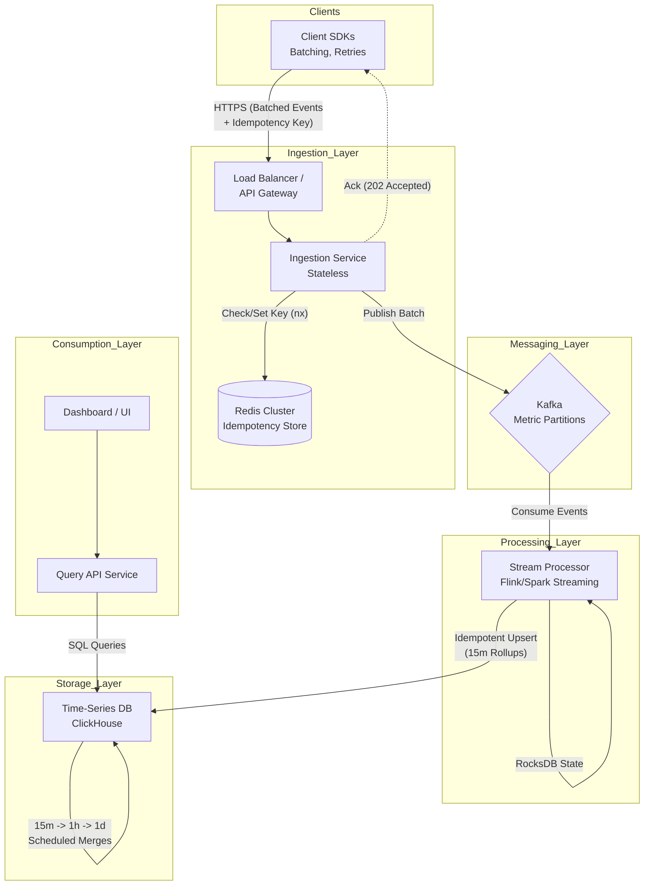
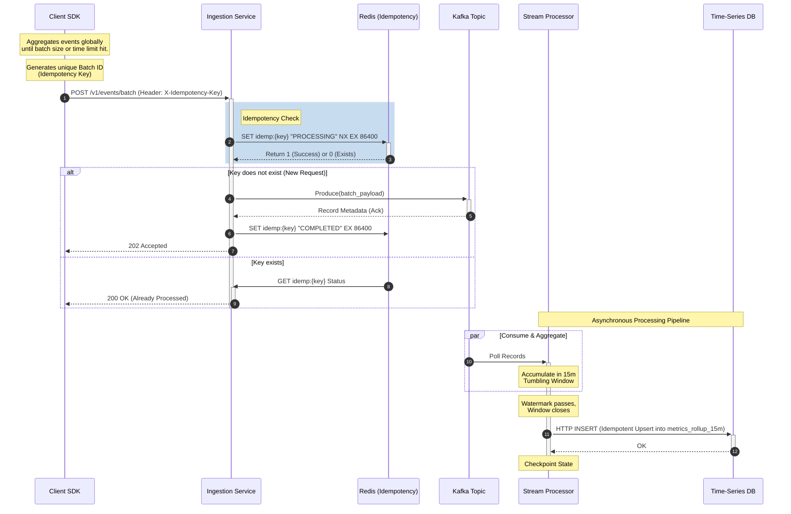

# Event Rollup-Aggregation System

## 1. Functional Requirements
* **Event Ingestion:** The system must accept telemetry/analytical events sent from various client applications via SDKs.
* **Client-Side Batching:** Client SDKs must aggregate events locally and send them in optimized batches to minimize network overhead.
* **Idempotency:** The system must handle network failures and retries gracefully, ensuring no duplicate events are processed if a client retries a failed batch.
* **Rollup Aggregation:** The server must process incoming events and aggregate data into distinct time buckets: 15-minute, 1-hour, and 1-day rollups.
* **Metric Computations:** The rollups must support standard statistical aggregations (e.g., Count, Sum, Min, Max).

## 2. Non-functional Requirements
* **High Throughput & Scalability:** Must handle millions of events per second (write-heavy workload).
* **Low Latency Ingestion:** Client applications must receive fast acknowledgments to avoid blocking client-side threads.
* **High Availability:** 99.99% uptime. The ingestion pipeline must remain available even if backend processing is delayed.
* **Eventual Consistency:** Real-time exactness is not strictly required; aggregations can be eventually consistent within a reasonable SLA (e.g., < 1 minute delay for 15m rollups).
* **Fault Tolerance:** System must recover from worker node failures without data loss.

## 3. Out-of-scope
* Client authentication, authorization, and API key management.
* Design of the frontend dashboard/UI to visualize the aggregated metrics.
* Internal system monitoring and alerting (e.g., monitoring the health of the Kafka cluster).
* Complex anomaly detection algorithms on the aggregated data.

## 4. High Level Architecture / Component Deep Dive

* **Client SDK:** Maintains an internal buffer. Flushes events based on `batch_size` (e.g., 100 events) or `time_interval` (e.g., 5 seconds). Generates a unique `idempotency_key` per batch.
* **Load Balancer / API Gateway:** Handles SSL termination, rate limiting, and routes traffic to the Ingestion Service.
* **Ingestion Service (Stateless):** A lightweight microservice that validates incoming batches, checks the `idempotency_key` against a distributed cache, and pushes the batch to a Message Queue. Returns a fast `202 Accepted` to the client.
* **Message Queue (Kafka):** Acts as a highly durable buffer, decoupling the fast ingestion from the heavier aggregation process. Partitions data based on `metric_name` or `client_id`.
* **Stream Processing Engine (Flink / Spark Streaming):** Consumes from Kafka. Maintains stateful tumbling windows for aggregation. Handles late arrivals and watermarking.
* **Storage Layer (Time-Series DB / Columnar DB):** Databases like ClickHouse, Apache Druid, or Cassandra, optimized for high write throughput and fast time-series analytical queries.

## 5. API Specifications

**Endpoint:** `POST /v1/events/batch`
**Headers:**
* `Authorization: Bearer <token>`
* `X-Idempotency-Key: <UUID>`

**Request Payload:**
```json
{
  "client_id": "app-web-frontend",
  "sent_at": "2026-04-29T11:39:00Z",
  "events": [
    {
      "event_id": "evt_12345",
      "metric_name": "page_load_time",
      "value": 1.2,
      "timestamp": "2026-04-29T11:38:55Z",
      "tags": { "platform": "web", "country": "IN" }
    },
    {
      "event_id": "evt_12346",
      "metric_name": "button_click",
      "value": 1,
      "timestamp": "2026-04-29T11:38:58Z",
      "tags": { "platform": "web", "button_id": "checkout" }
    }
  ]
}
```

## 6. Sequence Diagrams
### Write Path



### Read Path
This diagram shows how the generated rollups are consumed. Note that while the system ingests 15m, 1h, and 1d data, the Query API applies logic to select the most efficient table based on the requested time range.

```mermaid
sequenceDiagram
    autonumber
    actor User as User/Dashboard
    participant API as Query API Service
    participant TSDB as Time-Series DB (ClickHouse)

    User->>+API: GET /v1/metrics?name=page_load&from=T-24h&to=T&granularity=1h

    rect rgb(240, 240, 200)
        Note right of API: Query Planning Logic
        alt Range > 30 days
            Note right of API: Select table: metrics_rollup_1d
        alt Range > 24 hours AND < 30 days
            Note right of API: Select table: metrics_rollup_1h
        else Range < 24 hours
            Note right of API: Select table: metrics_rollup_15m
        end
    end

    API->>+TSDB: SELECT bucket_time, avg(sum/count) FROM metrics_rollup_1h WHERE... GROUP BY bucket_time
    TSDB-->>-API: Result Set
    
    Note over API: Format JSON response
    
    API-->>-User: 200 OK (Aggregated Time-Series Data)
```
