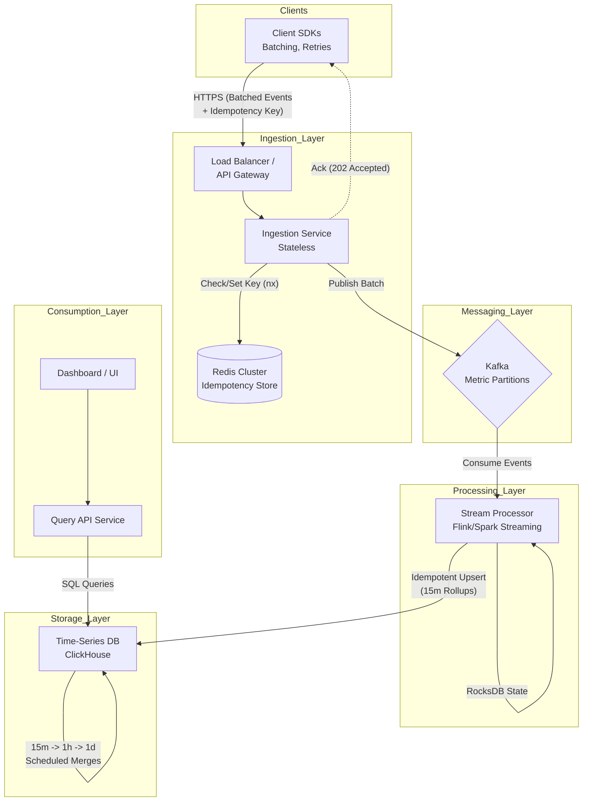
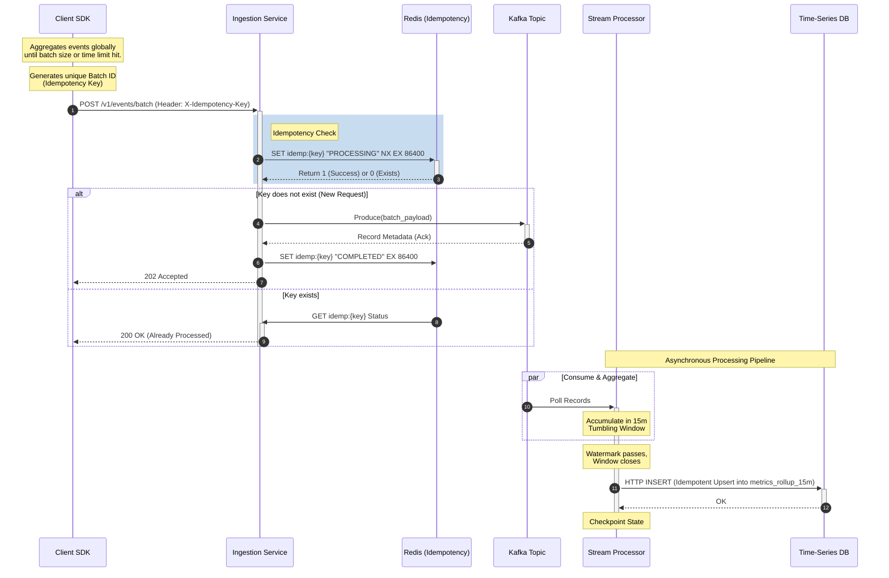
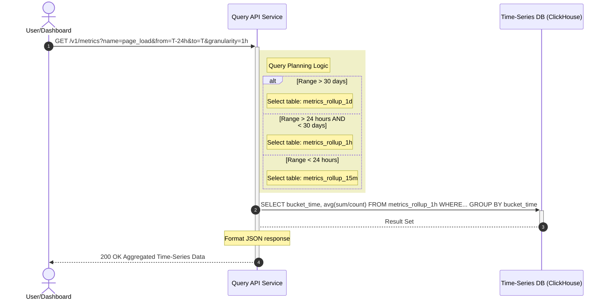

# Event Rollup-Aggregation System

## 1. Functional Requirements
* **Event Ingestion:** The system must accept telemetry/analytical events sent from various client applications via SDKs.
* **Client-Side Batching:** Client SDKs must aggregate events locally and send them in optimized batches to minimize network overhead.
* **Idempotency:** The system must handle network failures and retries gracefully, ensuring no duplicate events are processed if a client retries a failed batch.
* **Rollup Aggregation:** The server must process incoming events and aggregate data into distinct time buckets: 15-minute, 1-hour, and 1-day rollups.
* **Metric Computations:** The rollups must support standard statistical aggregations (e.g., Count, Sum, Min, Max).

## 2. Non-functional Requirements
* **High Throughput & Scalability:** Must handle millions of events per second (write-heavy workload).
* **Low Latency Ingestion:** Client applications must receive fast acknowledgments to avoid blocking client-side threads.
* **High Availability:** 99.99% uptime. The ingestion pipeline must remain available even if backend processing is delayed.
* **Eventual Consistency:** Real-time exactness is not strictly required; aggregations can be eventually consistent within a reasonable SLA (e.g., < 1 minute delay for 15m rollups).
* **Fault Tolerance:** System must recover from worker node failures without data loss.

## 3. Out-of-scope
* Client authentication, authorization, and API key management.
* Design of the frontend dashboard/UI to visualize the aggregated metrics.
* Internal system monitoring and alerting (e.g., monitoring the health of the Kafka cluster).
* Complex anomaly detection algorithms on the aggregated data.

## 4. High Level Architecture / Component Deep Dive

* **Client SDK:** Maintains an internal buffer. Flushes events based on `batch_size` (e.g., 100 events) or `time_interval` (e.g., 5 seconds). Generates a unique `idempotency_key` per batch.
* **Load Balancer / API Gateway:** Handles SSL termination, rate limiting, and routes traffic to the Ingestion Service.
* **Ingestion Service (Stateless):** A lightweight microservice that validates incoming batches, checks the `idempotency_key` against a distributed cache, and pushes the batch to a Message Queue. Returns a fast `202 Accepted` to the client.
* **Message Queue (Kafka):** Acts as a highly durable buffer, decoupling the fast ingestion from the heavier aggregation process. Partitions data based on `metric_name` or `client_id`.
* **Stream Processing Engine (Flink / Spark Streaming):** Consumes from Kafka. Maintains stateful tumbling windows for aggregation. Handles late arrivals and watermarking.
* **Storage Layer (Time-Series DB / Columnar DB):** Databases like ClickHouse, Apache Druid, or Cassandra, optimized for high write throughput and fast time-series analytical queries.

## 5. API Specifications

### 5.1 Write Path: Event Ingestion API

Used by client SDKs to publish batches of analytical events to the server.

**Endpoint:** `POST /v1/events/batch`
**Headers:**
* `Authorization: Bearer <token>`
* `X-Idempotency-Key: <UUID>`

**Request Payload:**
```json
{
  "client_id": "app-web-frontend",
  "sent_at": "2026-04-29T11:39:00Z",
  "events": [
    {
      "event_id": "evt_12345",
      "metric_name": "page_load_time",
      "value": 1.2,
      "timestamp": "2026-04-29T11:38:55Z",
      "tags": { "platform": "web", "country": "IN" }
    },
    {
      "event_id": "evt_12346",
      "metric_name": "button_click",
      "value": 1,
      "timestamp": "2026-04-29T11:38:58Z",
      "tags": { "platform": "web", "button_id": "checkout" }
    }
  ]
}
```
**Responses:**

`202 Accepted: Batch queued successfully.`

`200 OK: Batch already processed (Idempotency hit).`

`400 Bad Request: Invalid payload.`

`429 Too Many Requests: Rate limit exceeded.`

### 5.2 Read Path: Metric Query API

Used by frontend dashboards or internal analytical services to fetch aggregated time-series data. The system automatically routes the query to the optimized `15m`, `1h`, or `1d` rollup table based on the `granularity` parameter.

**Endpoint:** `GET /v1/metrics`

**Headers:**
* `Authorization`: `Bearer <token>`

**Query Parameters:**

| Parameter | Type | Required | Description | Example |
| :--- | :--- | :--- | :--- | :--- |
| `name` | String | Yes | The precise name of the metric to query. | `page_load_time` |
| `start_time` | String | Yes | ISO 8601 timestamp for the start of the query window. | `2026-04-28T00:00:00+05:30` |
| `end_time` | String | Yes | ISO 8601 timestamp for the end of the query window. | `2026-04-29T11:55:00+05:30` |
| `granularity` | Enum | Yes | Time bucket size. Maps to underlying tables. Valid values: `15m`, `1h`, `1d`. | `1h` |
| `aggregation` | Enum | No | The statistical function to apply. Valid values: `sum`, `count`, `avg`, `min`, `max`. Defaults to `avg`. | `avg` |
| `tags` | String | No | Comma-separated key-value pairs for filtering dimensions. | `platform:web,country:IN` |

**Example Request:**

```http
GET /v1/metrics?name=page_load_time&start_time=2026-04-28T00:00:00%2B05:30&end_time=2026-04-29T11:55:00%2B05:30&granularity=1h&aggregation=avg&tags=platform:web
```
**Success Response (200 OK):**
```json
{
  "query_metadata": {
    "metric_name": "page_load_time",
    "granularity": "1h",
    "aggregation": "avg",
    "filters": {
      "platform": "web"
    },
    "total_datapoints": 24
  },
  "data": [
    {
      "timestamp": "2026-04-28T00:00:00+05:30",
      "value": 1.23
    },
    {
      "timestamp": "2026-04-28T01:00:00+05:30",
      "value": 1.45
    },
    {
      "timestamp": "2026-04-28T02:00:00+05:30",
      "value": 1.10
    }
    // ... remaining data points
  ]
}
```

**HTTP Response Codes:**

`200 OK: Query successful.`

`400 Bad Request: Invalid time ranges (e.g., start_time > end_time), invalid granularity, or malformed tags.`

`401 Unauthorized: Invalid or missing authentication token.`

`404 Not Found: Metric name does not exist.`

`504 Gateway Timeout: The database query took too long to execute (usually requires narrowing the time range or optimizing tags).`

## 6. Persistence and Data Model

**1. Redis (Idempotency Store):**
* **Key:** `idemp:{client_id}:{X-Idempotency-Key}`
* **Value:** `status` (PROCESSING, COMPLETED)
* **TTL:** 24 to 48 hours to cover the standard retry window.

**2. Time-Series Database (e.g., ClickHouse):**
* **Table: `metrics_rollup_15m`**
  * `metric_name` (String, Partition Key)
  * `bucket_time` (Timestamp, Sort Key) - *Stored in UTC, queried with +05:30 offset if required by clients.*
  * `tags_hash` (UInt64)
  * `tags` (Map/JSON)
  * `count` (UInt64)
  * `sum` (Float64)
  * `min` (Float64)
  * `max` (Float64)
* **Tables: `metrics_rollup_1h`** and **`metrics_rollup_1d`** (Similar schema, coarser `bucket_time`).

## 7. Caching Strategies

* **Ingestion Cache (Redis):** Used exclusively for checking idempotency keys at the API edge. Must be highly available (Redis Cluster). Fast O(1) lookups prevent duplicate processing before events even hit the message queue.
* **State Checkpointing (Stream Processor Local State):** The aggregation workers maintain an in-memory cache (e.g., RocksDB embedded in Flink) to accumulate sums, counts, mins, and maxes for the current 15m window. This prevents database thrashing by ensuring we only write to the TSDB when the time window closes or a watermark is reached.
* **Query Caching (Read Path):** While out of scope for the ingestion pipeline, a read-heavy UI caching layer (like a CDN or Redis) is highly recommended for the `1d` rollups, as historical 1-day data becomes immutable once the window completely closes.

## 8. Deep dive on Rollup-Aggregation - Strategies and Algorithms

* **Hierarchical Rollup Strategy:** Instead of computing 15m, 1h, and 1d rollups directly from the raw data stream (which wastes compute and memory), we use a cascading approach:
  1. **Raw -> 15m:** The stream processor consumes raw events, groups by `(metric_name, tags, 15m_floor_timestamp)`, calculates aggregates, and emits to the DB.
  2. **15m -> 1h:** A scheduled job (or secondary stream) reads the newly closed 15m rollups. It aggregates four 15m buckets into one 1h bucket.
  3. **1h -> 1d:** A similar job aggregates twenty-four 1h buckets into one 1d bucket.

* **Windowing Algorithm:** We utilize **Tumbling Windows** (fixed-size, non-overlapping time intervals) aligned to the epoch.

* **Handling Late Events (Watermarks):** Due to client disconnection or network lag, events might arrive late. We define a "watermark" threshold (e.g., allow events up to 2 hours late). If an event falls into an already-closed 15m window, the stream processor triggers an "update" routine to recalculate and execute an idempotent upsert to overwrite that specific bucket in the TSDB.

## 9. Concurrency handling and distributed workflow - ensuring sync

* **Partitioning for Parallelism:** Kafka topics are partitioned by a consistent hash of `(metric_name + tags_hash)`. This guarantees that all events belonging to the same aggregation bucket are deterministically routed to the *same* worker node. This eliminates the need for complex distributed locks during aggregation.
* **Exactly-Once Processing Semantics:** To prevent data drift (over-counting or under-counting), the Stream Processor utilizes a two-phase commit protocol with the storage layer or relies on idempotent upserts in the TSDB (e.g., using `ReplacingMergeTree` in ClickHouse).
* **State Sync and Fault Tolerance:** If an aggregation worker dies mid-window, the processing engine's checkpointing mechanism (saving state snapshots to S3/HDFS every 10 seconds) allows a new worker to take over the partition and resume from the last known state without double-counting Kafka messages.

## 10. Sequence Diagrams
### Write Path



### Read Path
This diagram shows how the generated rollups are consumed. Note that while the system ingests 15m, 1h, and 1d data, the Query API applies logic to select the most efficient table based on the requested time range.



## 11. Trade-off decisions made

1. **At-Least-Once Delivery to Kafka vs. Exactly-Once Pipeline:** 
   * *Decision:* We handle idempotency at the ingestion API edge (via Redis) to prevent client retries from duplicating. From Kafka onwards, we rely on idempotent database upserts rather than complex, globally synchronized transactions.
   * *Trade-off:* Simplifies the ingestion system and keeps write throughput extremely high, but pushes the deduplication burden to the database engine's background merge processes.
2. **Cascading Rollups vs. Parallel Rollups:**
   * *Decision:* Using cascading/hierarchical rollups (15m -> 1h -> 1d).
   * *Trade-off:* Highly optimizes compute and DB I/O. The downside is that 1h and 1d dashboards experience a slight pipeline delay (they must wait for the underlying 15m windows to close before computing), which is an acceptable compromise for analytical workloads.
3. **Client Timestamp vs. Server Timestamp:**
   * *Decision:* Aggregations are strictly bucketed based on the `timestamp` generated by the client, *not* the server ingestion time.
   * *Trade-off:* This is crucial for accurate business telemetry, but requires complex handling of late arrivals, watermarking, and defensive filtering against extreme clock skew (e.g., dropping events dated years in the past/future).

## 12. Handling Granularity Edge Cases and Custom Time Ranges

When utilizing a rollup-aggregation strategy, the fundamental trade-off is the loss of high-resolution intra-bucket data. Because our lowest granularity is 15 minutes, we must establish strict rules for how the Read API handles queries that do not align perfectly with these boundaries.

### 1. Requesting a finer granularity (e.g., 5m aggregation)
**Problem:** The user requests `granularity=5m` but our lowest base rollup is 15m.
**Resolution:** It is mathematically impossible to accurately reconstruct 5m buckets from 15m rollups without raw data. 
* **API Behavior:** The API must strictly validate the `granularity` parameter. If a client requests a granularity lower than 15m, the API will immediately reject the request with a `400 Bad Request: Minimum supported granularity is 15m`.
* **Design Alternative:** If 5m granularity is a strict business requirement, the base rollup in the Stream Processor must be changed from 15m to 5m (or 1m). The cascading rollup strategy would then become `1m -> 15m -> 1h -> 1d`.

### 2. Custom Time Ranges & Boundary Crossing
**Problem:** A query requests a custom time range that falls within or crosses 15m boundaries (e.g., `10:10:00` to `10:40:00`). We only have data for the `10:00:00`, `10:15:00`, and `10:30:00` buckets. We do not know how many events occurred exactly between `10:10` and `10:15`.

**Resolution Strategies:**

We address this using a combination of **API enforced bucket-snapping** and a **Lambda Architecture fallback**, depending on the business requirements for exactness.

#### Approach A: UI/API Bucket Snapping (The Standard Analytical Approach)
Most analytical systems (like Datadog or Grafana) handle this by aligning (snapping) the user's requested time range to the nearest available bucket boundaries.
* **Inclusive Snapping (Over-reporting):** The API expands the query to include any bucket that *intersects* the requested range. For `10:10 to 10:40`, the API queries the `10:00`, `10:15`, and `10:30` buckets. 
* **Exclusive Snapping (Under-reporting):** The API only includes fully enclosed buckets. For `10:10 to 10:40`, it only queries `10:15`.
* **Implementation Decision:** We will use **Inclusive Snapping**. The Query API will round down the `start_time` to the nearest 15m floor (`10:00:00`) and round up the `end_time` to the nearest 15m ceiling (`10:45:00`). The UI is expected to clearly indicate to the user that data is quantized to 15-minute intervals.

#### Approach B: Pro-Rata Interpolation (Avoided)
It is possible to estimate the data. If the `10:00 to 10:15` bucket has 150 events, and the user queries from `10:10`, we could assume a uniform distribution (10 events per minute) and attribute 50 events to the `10:10 to 10:15` window.
* **Decision:** We **do not** use this. Telemetry and analytical events are highly sporadic. Assuming uniform distribution leads to mathematically inaccurate and misleading data.

#### Approach C: The Lambda Architecture (Raw Data Fallback)
If business requirements dictate that users *must* be able to query exact, down-to-the-second custom ranges (e.g., exactly `10:10:33` to `10:18:12`), a strict rollup system is insufficient. 
* **Decision/Addition:** We introduce a short-lived Raw Event Table.
  * The ingestion pipeline writes the raw, unaggregated events into a `metrics_raw` table in ClickHouse.
  * A strict TTL (Time-To-Live) is applied to this table (e.g., 3 to 7 days) to prevent storage explosion.
  * **Query Routing:** The Query API checks the request. If the query requires sub-15m precision AND falls within the 7-day retention window, the API queries the `metrics_raw` table and computes the aggregation on the fly. If it falls outside the 7-day window, it falls back to the 15m rollup tables and applies bucket snapping (Approach A).
 
## 13. Windowing Strategies: Raw Fallback and Tumbling vs. Sliding

### 1. Windowing in the Raw Data Fallback (Lambda Architecture)

When a query falls back to the `metrics_raw` table, we are no longer dealing with the Stream Processor's pre-computed windows. Instead, we compute the windows **on-demand at query time**.

* **Dynamic Tumbling Windows:** If the user requests a time-series graph from `10:12` to `10:37` with a `1m` granularity, the Query API translates this into a SQL query that applies a dynamic tumbling window.
* **Database Implementation:** In a TSDB like ClickHouse, this is achieved using interval rounding functions within the query, strictly bounded by the custom time range.
  * *Example SQL:* `SELECT toStartOfInterval(timestamp, INTERVAL 1 minute) as bucket, count() FROM metrics_raw WHERE timestamp BETWEEN '10:12:00' AND '10:37:00' GROUP BY bucket`
* **Conclusion:** The fallback path still utilizes **tumbling windows**, but they are generated dynamically on read, exactly aligned to the user's custom boundaries, rather than pre-computed on write.

### 2. Why Tumbling Windows over Sliding Windows for Rollup Aggregation?

In stream processing, **Tumbling Windows** are fixed, non-overlapping time intervals (e.g., 10:00-10:15, 10:15-10:30), whereas **Sliding Windows** overlap and update at a defined frequency (e.g., a 15m window that updates every 1m: 10:00-10:15, 10:01-10:16, 10:02-10:17).

We explicitly chose Tumbling Windows for the ingestion pipeline due to the following critical architectural requirements:

**A. Storage Efficiency and Write Amplification**
* **Sliding:** If we used a 15m window sliding every 1m, a single incoming event would belong to 15 different windows. The stream processor would need to emit 15 distinct updates to the database for every single event bucket, causing massive write amplification and ballooning storage costs.
* **Tumbling:** An event belongs to exactly one 15m bucket. 1 event = 1 bucket update.

**B. Enabling Cascading/Hierarchical Rollups (The Deciding Factor)**
* **Tumbling:** Because tumbling windows do not overlap, they are perfectly additive. We can safely sum four `15m` buckets to create one `1h` bucket without double-counting any events. `(10:00-10:15) + (10:15-10:30) + (10:30-10:45) + (10:45-11:00) = (10:00-11:00)`.
* **Sliding:** Sliding windows inherently duplicate data across buckets. You cannot easily aggregate 15m sliding windows into a 1h window because you would heavily over-count the events that exist in the overlapping intervals. You would be forced to go back to the raw data stream to compute the 1h and 1d rollups, defeating the purpose of our compute-optimized cascading strategy.

**C. Analytical Standard**
Most downstream visualization tools (dashboards, bar charts, line graphs) inherently plot data in contiguous, non-overlapping chronological chunks. Tumbling windows directly map to the X-axis pixels of standard analytical UI components.
